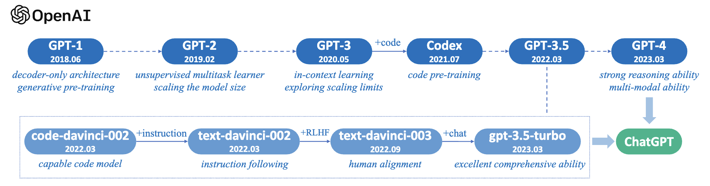

<h1 align="center">A curated list of GitHub repos, papers, resources and projects on Large Language Models (LLMs)</h1>

---

This list aims to help practitioners (including myself!) navigate the vast landscape of large language models (LLMs) and their applications in natural language processing (NLP) applications.

**Disclaimer:** The information provided in this repo does not, and is not intended to, constitute legal advice. Maintainers of this repo are not responsible for the actions of third parties who use the models. Please consult an attorney before using models for commercial purposes.

---

# Table of contents
<!-- no toc -->

- [Table of contents](#table-of-contents)
- [Evolution of LLMs](#evolution-of-llms)
  - [Evolutionary tree of LLMs](#evolutionary-tree-of-llms)
  - [Evolutionary tree of the LLaMA Family](#evolutionary-tree-of-the-llama-family)
  - [Evolution of GPT-series models](#evolution-of-gpt-series-models)
- [Open LLMs](#open-llms)
  - [Open LLMs for code](#open-llms-for-code)
  - [Open LLM datasets for pre-training](#open-llm-datasets-for-pre-training)
  - [Open LLM datasets for instruction-tuning](#open-llm-datasets-for-instruction-tuning)
  - [Open LLM datasets for alignment-tuning](#open-llm-datasets-for-alignment-tuning)
    - [What do the various licenses mean?](#what-do-the-various-licenses-mean)
- [Papers](#papers)
  - [Resources of LLMs](#resources-of-llms)
    - [Publicly Available Models](#publicly-available-models)
    - [Closed-source Models](#closed-source-models)
    - [Commonly Used Corpora](#commonly-used-corpora)
    - [Library Resources](#library-resources)
    - [Deep Learning Frameworks](#deep-learning-frameworks)
  - [Pre-training](#pre-training)
    - [Data Collection](#data-collection)
    - [Architectures](#architectures)
      - [Mainstream Architectures](#mainstream-architectures)
      - [Detailed Configuration](#detailed-configuration)
      - [Analysis](#analysis)
    - [Training Algorithms](#training-algorithms)
    - [Pre-training on Code](#pre-training-on-code)
      - [LLMs for Program Synthesis](#llms-for-program-synthesis)
      - [NLP Tasks Formatted as Code](#nlp-tasks-formatted-as-code)
  - [Adaptation Tuning](#adaptation-tuning)
    - [Instruction Tuning](#instruction-tuning)
    - [Alignment Tuning](#alignment-tuning)
    - [Parameter-Efficient Model Adaptation](#parameter-efficient-model-adaptation)
    - [Memory-Efficient Model Adaptation](#memory-efficient-model-adaptation)
  - [Utilization](#utilization)
    - [In-Context Learning (ICL)](#in-context-learning-icl)
    - [Chain-of-Thought Reasoning (CoT)](#chain-of-thought-reasoning-cot)
    - [Planning for Complex Task Solving](#planning-for-complex-task-solving)
  - [Capacity Evaluation](#capacity-evaluation)
- [GitHub repos](#github-repos)

# Evolution of LLMs

## Evolutionary tree of LLMs

The following figure depicts an evolutionary tree of the main LLMs since 2018.

## Evolutionary tree of the LLaMA Family

The following figure is an evolutionary graph of the research work conducted on LLaMA models.

## Evolution of GPT-series models

A brief illustration for the technical evolution of GPT-series models. This figure is mainly based on papers, blog articles and official APIs from [OpenAI](https://www.openai.com).

# Open LLMs

LLMs licensed for commercial use (e.g., Apache 2.0, MIT, OpenRAIL-M).

| Language Model | Release Date | Checkpoints | Paper/Blog | Params (B) | Context Length | Licence | Try it                                                                                                                |
| --- | --- | --- | --- | --- | --- | --- |-----------------------------------------------------------------------------------------------------------------------|
| T5           | 2019/10 |[T5 & Flan-T5](https://github.com/google-research/t5x/blob/main/docs/models.md#flan-t5-checkpoints), [Flan-T5-xxl (HF)](https://huggingface.co/google/flan-t5-xxl)      | [Exploring the Limits of Transfer Learning with a Unified Text-to-Text Transformer](https://github.com/google-research/text-to-text-transfer-transformer#released-model-checkpoints) | 0.06 - 11       | [512](https://discuss.huggingface.co/t/does-t5-truncate-input-longer-than-512-internally/3602) | Apache 2.0         | [T5-Large](https://github.com/slai-labs/get-beam/tree/main/examples/t5)                                               |
| UL2          | 2022/10 | [UL2 & Flan-UL2](https://github.com/google-research/google-research/tree/master/ul2#checkpoints), [Flan-UL2 (HF)](https://huggingface.co/google/flan-ul2)          | [UL2 20B: An Open Source Unified Language Learner](https://ai.googleblog.com/2022/10/ul2-20b-open-source-unified-language.html)                                                       | 20             | [512, 2048](https://huggingface.co/google/flan-ul2#tldr) | Apache 2.0         |                                                                                                                       |
| Cerebras-GPT | 2023/03 | [Cerebras-GPT](https://huggingface.co/cerebras)                                           | [Cerebras-GPT: A Family of Open, Compute-efficient, Large Language Models](https://www.cerebras.net/blog/cerebras-gpt-a-family-of-open-compute-efficient-large-language-models/) ([Paper](https://arxiv.org/abs/2304.03208)) | 0.111 - 13      | [2048](https://huggingface.co/cerebras/Cerebras-GPT-13B#model-details) | Apache 2.0         | [Cerebras-GPT-1.3B](https://github.com/slai-labs/get-beam/tree/main/examples/cerebras-gpt)                            |
| Open Assistant (Pythia family) | 2023/03 | [OA-Pythia-12B-SFT-8](https://huggingface.co/OpenAssistant/pythia-12b-sft-v8-7k-steps), [OA-Pythia-12B-SFT-4](https://huggingface.co/OpenAssistant/oasst-sft-4-pythia-12b-epoch-3.5), [OA-Pythia-12B-SFT-1](https://huggingface.co/OpenAssistant/oasst-sft-1-pythia-12b) | [Democratizing Large Language Model Alignment](https://arxiv.org/abs/2304.07327) | 12     | [2048](https://huggingface.co/OpenAssistant/pythia-12b-sft-v8-7k-steps/blob/main/config.json)  | Apache 2.0                | [Pythia-2.8B](https://github.com/slai-labs/get-beam/tree/main/examples/pythia)                                        |
| Pythia       | 2023/04 | [pythia 70M - 12B](https://github.com/EleutherAI/pythia)                                   | [Pythia: A Suite for Analyzing Large Language Models Across Training and Scaling](https://arxiv.org/abs/2304.01373)                                                                    | 0.07 - 12       | [2048](https://arxiv.org/pdf/2304.01373.pdf) | Apache 2.0         |                                                                                                                       |
| Dolly        | 2023/04 | [dolly-v2-12b](https://huggingface.co/databricks/dolly-v2-12b)                            | [Free Dolly: Introducing the World's First Truly Open Instruction-Tuned LLM](https://www.databricks.com/blog/2023/04/12/dolly-first-open-commercially-viable-instruction-tuned-llm)             | 3, 7, 12     | [2048](https://github.com/databrickslabs/dolly#dolly) | MIT                |                                                                                                                       |
| DLite | 2023/05 | [dlite-v2-1_5b](https://huggingface.co/aisquared/dlite-v2-1_5b) | [Announcing DLite V2: Lightweight, Open LLMs That Can Run Anywhere](https://medium.com/ai-squared/announcing-dlite-v2-lightweight-open-llms-that-can-run-anywhere-a852e5978c6e) | 0.124 - 1.5 | [1024](https://huggingface.co/aisquared/dlite-v2-1_5b/blob/main/config.json) | Apache 2.0         | [DLite-v2-1.5B](https://github.com/slai-labs/get-beam/tree/main/examples/dlite-v2)                                    |
| RWKV         | 2021/08| [RWKV, ChatRWKV](https://github.com/BlinkDL/RWKV-LM#rwkv-parallelizable-rnn-with-transformer-level-llm-performance-pronounced-as-rwakuv-from-4-major-params-r-w-k-v) | [The RWKV Language Model (and my LM tricks)](https://github.com/BlinkDL/RWKV-LM)                                           | 0.1 - 14      | [infinity (RNN)](https://github.com/BlinkDL/RWKV-LM#rwkv-parallelizable-rnn-with-transformer-level-llm-performance-pronounced-as-rwakuv-from-4-major-params-r-w-k-v) | Apache 2.0         |                                                                                                                       |
| GPT-J-6B | 2023/06 | [GPT-J-6B](https://github.com/kingoflolz/mesh-transformer-jax/#gpt-j-6b), [GPT4All-J](https://github.com/nomic-ai/gpt4all#raw-model) | [GPT-J-6B: 6B JAX-Based Transformer](https://arankomatsuzaki.wordpress.com/2021/06/04/gpt-j/) | 6 | [2048](https://github.com/kingoflolz/mesh-transformer-jax/#gpt-j-6b) | Apache 2.0 |                                                                                                                       |
| GPT-NeoX-20B | 2022/04 | [GPT-NEOX-20B](https://huggingface.co/EleutherAI/gpt-neox-20b) | [GPT-NeoX-20B: An Open-Source Autoregressive Language Model](https://arxiv.org/abs/2204.06745) | 20 | [2048](https://huggingface.co/EleutherAI/gpt-neox-20b) | Apache 2.0 |                                                                                                                       |
| Bloom | 2022/11 | [Bloom](https://huggingface.co/bigscience/bloom) | [BLOOM: A 176B-Parameter Open-Access Multilingual Language Model](https://arxiv.org/abs/2211.05100) | 176 | [2048](https://huggingface.co/bigscience/bloom) |  [OpenRAIL-M v1](https://huggingface.co/spaces/bigcode/bigcode-model-license-agreement) |                                                                                                                       |
| StableLM-Alpha | 2023/04 | [StableLM-Alpha](https://github.com/Stability-AI/StableLM#stablelm-alpha) | [Stability AI Launches the First of its StableLM Suite of Language Models](https://stability.ai/blog/stability-ai-launches-the-first-of-its-stablelm-suite-of-language-models) | 3 - 65 | [4096](https://github.com/Stability-AI/StableLM#stablelm-alpha) | CC BY-SA-4.0 |                                                                                                                       |
| FastChat-T5 | 2023/04 | [fastchat-t5-3b-v1.0](https://huggingface.co/lmsys/fastchat-t5-3b-v1.0) | [We are excited to release FastChat-T5: our compact and commercial-friendly chatbot!](https://twitter.com/lmsysorg/status/1652037026705985537?s=20) | 3 | [512](https://huggingface.co/lmsys/fastchat-t5-3b-v1.0/blob/main/config.json) | Apache 2.0 |                                                                                                                       |
| h2oGPT | 2023/05 | [h2oGPT](https://github.com/h2oai/h2ogpt) | [Building the World’s Best Open-Source Large Language Model: H2O.ai’s Journey](https://h2o.ai/blog/building-the-worlds-best-open-source-large-language-model-h2o-ais-journey/) | 12 - 20 | [256 - 2048](https://huggingface.co/h2oai) | Apache 2.0 |                                                                                                                       |
| MPT-7B | 2023/05 | [MPT-7B](https://huggingface.co/mosaicml/mpt-7b), [MPT-7B-Instruct](https://huggingface.co/mosaicml/mpt-7b-instruct) | [Introducing MPT-7B: A New Standard for Open-Source, Commercially Usable LLMs](https://www.mosaicml.com/blog/mpt-7b) | 7 | [84k (ALiBi)](https://huggingface.co/mosaicml/mpt-7b#how-is-this-model-different) | Apache 2.0, CC BY-SA-3.0 |                                                                                                                       |
| RedPajama-INCITE | 2023/05 | [RedPajama-INCITE](https://huggingface.co/togethercomputer) | [Releasing 3B and 7B RedPajama-INCITE family of models including base, instruction-tuned & chat models](https://www.together.xyz/blog/redpajama-models-v1) | 3 - 7 | [2048](https://huggingface.co/togethercomputer/RedPajama-INCITE-Instruct-7B-v0.1/blob/157bf3174feebb67f37e131ea68f84dee007c687/config.json#L13) | Apache 2.0 | [RedPajama-INCITE-Instruct-3B-v1](https://github.com/slai-labs/get-beam/tree/main/examples/redpajama-incite-instruct) |
| OpenLLaMA | 2023/05 | [open_llama_3b](https://huggingface.co/openlm-research/open_llama_3b), [open_llama_7b](https://huggingface.co/openlm-research/open_llama_7b), [open_llama_13b](https://huggingface.co/openlm-research/open_llama_13b) | [OpenLLaMA: An Open Reproduction of LLaMA](https://github.com/openlm-research/open_llama) | 3, 7 | [2048](https://huggingface.co/h2oai) | Apache 2.0 | [OpenLLaMA-7B-Preview_200bt](https://github.com/slai-labs/get-beam/tree/main/examples/openllama)                      |
| Falcon | 2023/05 | [Falcon-40B](https://huggingface.co/tiiuae/falcon-40b), [Falcon-7B](https://huggingface.co/tiiuae/falcon-7b) | [The RefinedWeb Dataset for Falcon LLM: Outperforming Curated Corpora with Web Data, and Web Data Only](https://arxiv.org/abs/2306.01116) | 7, 40 | [2048](https://huggingface.co/tiiuae/falcon-7b/blob/main/config.json) | Apache 2.0 | 
| MPT-30B | 2023/06 | [MPT-30B](https://huggingface.co/mosaicml/mpt-30b), [MPT-30B-instruct](https://huggingface.co/mosaicml/mpt-30b-instruct) | [MPT-30B: Raising the bar for open-source foundation models](https://www.mosaicml.com/blog/mpt-30b) | 30 | [8192](https://huggingface.co/mosaicml/mpt-30b/blob/main/config.json) | Apache 2.0, CC BY-SA-3.0 | [MPT 30B inference code using CPU](https://github.com/abacaj/mpt-30B-inference) |
| LLaMA 2  | 2023/06 | [LLaMA 2 Weights](https://ai.meta.com/resources/models-and-libraries/llama-downloads/) | [Llama 2: Open Foundation and Fine-Tuned Chat Models](https://scontent-ham3-1.xx.fbcdn.net/v/t39.2365-6/10000000_662098952474184_2584067087619170692_n.pdf?_nc_cat=105&ccb=1-7&_nc_sid=3c67a6&_nc_ohc=qhK-ahCbkBMAX94XV2X&_nc_ht=scontent-ham3-1.xx&oh=00_AfDB7dN8momft9nkv8X0gqrZdEnKltVjPOxhKBm0XLRinA&oe=64BE66FF)      | 7 - 70       | [4096](https://scontent-ham3-1.xx.fbcdn.net/v/t39.2365-6/10000000_662098952474184_2584067087619170692_n.pdf?_nc_cat=105&ccb=1-7&_nc_sid=3c67a6&_nc_ohc=qhK-ahCbkBMAX94XV2X&_nc_ht=scontent-ham3-1.xx&oh=00_AfDB7dN8momft9nkv8X0gqrZdEnKltVjPOxhKBm0XLRinA&oe=64BE66FF)  | [Custom](https://github.com/facebookresearch/llama/blob/main/LICENSE) Free if you have under 700M users and you cannot use LLaMA outputs to train other LLMs besides LLaMA and its derivatives   | [HuggingChat](https://huggingface.co/blog/llama2#demo) |  
| OpenLM  | 2023/09 | [OpenLM 1B](https://huggingface.co/mlfoundations/open_lm_1B), [OpenLM 7B](https://huggingface.co/mlfoundations/open_lm_7B_1.25T) | [Open LM:  a minimal but performative language modeling (LM) repository](https://github.com/mlfoundations/open_lm#pretrained-models)      | 1, 7       | [2048](https://github.com/mlfoundations/open_lm/blob/main/open_lm/model_configs/open_lm_7b.json)  | MIT   |      |  
| Mistral 7B | 2023/09 | [Mistral-7B-v0.1](https://huggingface.co/mistralai/Mistral-7B-v0.1), [Mistral-7B-Instruct-v0.1](https://huggingface.co/mistralai/Mistral-7B-Instruct-v0.1) | [Mistral 7B](https://mistral.ai/news/announcing-mistral-7b/) | 7 | [4096-16K with Sliding Windows](https://huggingface.co/mistralai/Mistral-7B-Instruct-v0.1/blob/main/config.json)| Apache 2.0 | [Mistral Transformer](https://github.com/mistralai/mistral-src)

## Open LLMs for code  

| Language Model | Release Date | Checkpoints | Paper/Blog | Params (B) | Context Length                                                                         | Licence | Try it                                                                                    |
| --- | --- | --- | --- | --- |----------------------------------------------------------------------------------------| --- |-------------------------------------------------------------------------------------------|
| SantaCoder | 2023/01 | [santacoder](https://huggingface.co/bigcode/santacoder) |[SantaCoder: don't reach for the stars!](https://arxiv.org/abs/2301.03988) | 1.1 | [2048](https://huggingface.co/bigcode/santacoder/blob/main/README.md#model-summary)                | [OpenRAIL-M v1](https://huggingface.co/spaces/bigcode/bigcode-model-license-agreement) | [SantaCoder](https://github.com/slai-labs/get-beam/tree/main/examples/santacoder)         |
| StarCoder | 2023/05 | [starcoder](https://huggingface.co/bigcode/starcoder) | [StarCoder: A State-of-the-Art LLM for Code](https://huggingface.co/blog/starcoder), [StarCoder: May the source be with you!](https://drive.google.com/file/d/1cN-b9GnWtHzQRoE7M7gAEyivY0kl4BYs/view) | 1.1-15 | [8192](https://huggingface.co/bigcode/starcoder#model-summary)                         | [OpenRAIL-M v1](https://huggingface.co/spaces/bigcode/bigcode-model-license-agreement) |                                                                                           |
| StarChat Alpha | 2023/05 | [starchat-alpha](https://huggingface.co/HuggingFaceH4/starchat-alpha) | [Creating a Coding Assistant with StarCoder](https://huggingface.co/blog/starchat-alpha) | 16 | [8192](https://huggingface.co/bigcode/starcoder#model-summary)  | [OpenRAIL-M v1](https://huggingface.co/spaces/bigcode/bigcode-model-license-agreement) |                                                                                           |
| Replit Code | 2023/05 | [replit-code-v1-3b](https://huggingface.co/replit/replit-code-v1-3b) | [Training a SOTA Code LLM in 1 week and Quantifying the Vibes — with Reza Shabani of Replit](https://www.latent.space/p/reza-shabani#details) | 2.7 | [infinity? (ALiBi)](https://huggingface.co/replit/replit-code-v1-3b#model-description) | CC BY-SA-4.0 | [Replit-Code-v1-3B](https://github.com/slai-labs/get-beam/tree/main/examples/replit-code) |
| CodeGen2 | 2023/04 | [codegen2 1B-16B](https://github.com/salesforce/CodeGen2) | [CodeGen2: Lessons for Training LLMs on Programming and Natural Languages](https://arxiv.org/abs/2305.02309) | 1 - 16 | [2048](https://arxiv.org/abs/2305.02309) | [Apache 2.0](https://github.com/salesforce/CodeGen2/blob/main/LICENSE)|                                                                                           |
| CodeT5+ | 2023/05 | [CodeT5+](https://github.com/salesforce/CodeT5/tree/main/CodeT5+)     | [CodeT5+: Open Code Large Language Models for Code Understanding and Generation](https://arxiv.org/abs/2305.07922) | 0.22 - 16 | [512](https://arxiv.org/abs/2305.07922)                                                                                | [BSD-3-Clause](https://github.com/salesforce/CodeT5/blob/main/LICENSE.txt)                                                           | [Codet5+-6B](https://github.com/slai-labs/get-beam/tree/main/examples/codeT5%2B)          |
| XGen-7B | 2023/06 | [XGen-7B-8K-Base](https://huggingface.co/Salesforce/xgen-7b-8k-base) | [Long Sequence Modeling with XGen: A 7B LLM Trained on 8K Input Sequence Length](https://blog.salesforceairesearch.com/xgen/) | 7 | [8192](https://huggingface.co/Salesforce/xgen-7b-8k-base/blob/main/config.json) | [Apache 2.0](https://github.com/salesforce/xgen/blob/main/LICENSE) | 
| CodeGen2.5 | 2023/07 | [CodeGen2.5-7B-multi](https://huggingface.co/Salesforce/codegen25-7b-multi) | [CodeGen2.5: Small, but mighty](https://blog.salesforceairesearch.com/codegen25/) | 7 | [2048](https://huggingface.co/Salesforce/codegen25-7b-multi/blob/main/config.json) | [Apache 2.0](https://huggingface.co/Salesforce/codegen25-7b-multi/blob/main/README.md) | 
| DeciCoder-1B | 2023/08 | [DeciCoder-1B](https://huggingface.co/Deci/DeciCoder-1b#how-to-use) | [Introducing DeciCoder: The New Gold Standard in Efficient and Accurate Code Generation](https://deci.ai/blog/decicoder-efficient-and-accurate-code-generation-llm/) | 1.1 | [2048](https://huggingface.co/Deci/DeciCoder-1b#model-architecture) | Apache 2.0 |  [DeciCoder Demo](https://huggingface.co/spaces/Deci/DeciCoder-Demo)|
| Code Llama  | 2023 | [Inference Code for CodeLlama models]([https://ai.meta.com/resources/models-and-libraries/llama-downloads/](https://github.com/facebookresearch/codellama)) | [Code Llama: Open Foundation Models for Code](https://ai.meta.com/research/publications/code-llama-open-foundation-models-for-code/)     | 7 - 34       | [4096](https://scontent-zrh1-1.xx.fbcdn.net/v/t39.2365-6/369856151_1754812304950972_1159666448927483931_n.pdf?_nc_cat=107&ccb=1-7&_nc_sid=3c67a6&_nc_ohc=wURKmnWKaloAX-ib5XW&_nc_ht=scontent-zrh1-1.xx&oh=00_AfAN1GB2K_XwIz54PqXTr-dhilI3CfCwdQoaLMyaYEEECg&oe=64F0A68F)  | [Custom](https://github.com/facebookresearch/llama/blob/main/LICENSE) Free if you have under 700M users and you cannot use LLaMA outputs to train other LLMs besides LLaMA and its derivatives   | [HuggingChat](https://huggingface.co/blog/codellama) |

## Open LLM datasets for pre-training

| Name | Release Date | Paper/Blog | Dataset | Tokens (T) | License |
| --- | --- | --- | --- | --- | ---- | 
| starcoderdata | 2023/05 | [StarCoder: A State-of-the-Art LLM for Code](https://huggingface.co/blog/starcoder) | [starcoderdata](https://huggingface.co/datasets/bigcode/starcoderdata) |  0.25 | Apache 2.0 |
| RedPajama | 2023/04 | [RedPajama, a project to create leading open-source models, starts by reproducing LLaMA training dataset of over 1.2 trillion tokens](https://www.together.xyz/blog/redpajama) | [RedPajama-Data](https://github.com/togethercomputer/RedPajama-Data) | 1.2 | Apache 2.0 |

## Open LLM datasets for instruction-tuning

| Name | Release Date |  Paper/Blog | Dataset | Samples (K) | License |
| --- | --- | --- | --- | --- | ---- | 
| MPT-7B-Instruct | 2023/05 | [Introducing MPT-7B: A New Standard for Open-Source, Commercially Usable LLMs](https://www.mosaicml.com/blog/mpt-7b) | [dolly_hhrlhf](https://huggingface.co/datasets/mosaicml/dolly_hhrlhf) | 59 | CC BY-SA-3.0 |
| databricks-dolly-15k | 2023/04 | [Free Dolly: Introducing the World's First Truly Open Instruction-Tuned LLM](https://www.databricks.com/blog/2023/04/12/dolly-first-open-commercially-viable-instruction-tuned-llm) |  [databricks-dolly-15k](https://huggingface.co/datasets/databricks/databricks-dolly-15k) | 15 |  CC BY-SA-3.0 |
| OIG (Open Instruction Generalist)   | 2023/03 | [THE OIG DATASET](https://laion.ai/blog/oig-dataset/) | [OIG](https://huggingface.co/datasets/laion/OIG) | 44,000 | Apache 2.0 |

## Open LLM datasets for alignment-tuning

| Name | Release Date |  Paper/Blog | Dataset | Samples (K) | License |
| --- | --- | --- | --- | --- | ---- |
| OpenAssistant Conversations Dataset | 2023/04 | [OpenAssistant Conversations - Democratizing Large Language Model Alignment](https://drive.google.com/file/d/10iR5hKwFqAKhL3umx8muOWSRm7hs5FqX/view) | [oasst1](https://huggingface.co/datasets/OpenAssistant/oasst1) | 161 | Apache 2.0 |

---

### What do the various licenses mean?

- [Apache 2.0](https://en.wikipedia.org/wiki/Apache_License): Allows users to use the software for any purpose, to distribute it, to modify it, and to distribute modified versions of the software under the terms of the license, without concern for royalties.
- [MIT](https://en.wikipedia.org/wiki/MIT_License): Similar to Apache 2.0 but shorter and simpler. Also, in contrast to Apache 2.0, does not require stating any significant changes to the original code.
- [CC BY-SA-4.0](https://creativecommons.org/licenses/by-sa/4.0/): Allows (i) copying and redistributing the material and (ii) remixing, transforming, and building upon the material
for any purpose, even commercially. But if you do the latter, you **must distribute your contributions under the same license as the original.** (Thus, may not be viable for internal teams.)
- [OpenRAIL-M v1](https://www.bigcode-project.org/docs/pages/model-license/): Allows royalty-free access and flexible downstream use and sharing of the model and modifications of it, and comes with a set of use restrictions (see [Attachment A](https://huggingface.co/spaces/bigcode/bigcode-model-license-agreement))
- [BSD-3-Clause](https://en.wikipedia.org/wiki/BSD_licenses): This version allows unlimited redistribution for any purpose as long as its copyright notices and the license's disclaimers of warranty are maintained.

---

# Papers

## Resources of LLMs

### Publicly Available Models

1. <u>T5</u>: **"Exploring the Limits of Transfer Learning with a Unified Text-to-Text Transformer"**. *Colin Raffel et al.* JMLR 2019. [[Paper](https://arxiv.org/abs/1910.10683)] [[Checkpoint](https://huggingface.co/t5-11b)]
2. <u>mT5</u>: **"mT5: A massively multilingual pre-trained text-to-text transformer"**. *Linting Xue* et al. NAACL 2021. [[Paper](https://arxiv.org/abs/2010.11934)] [[Checkpoint](https://huggingface.co/google/mt5-xxl/tree/main)]
3. <u>PanGu-α</u>: **"PanGu-α: Large-scale Autoregressive Pretrained Chinese Language Models with Auto-parallel Computation"**. *Wei Zeng et al.* arXiv 2021. [[Paper](https://arxiv.org/abs/2104.12369)] [[Checkpoint](https://openi.pcl.ac.cn/PCL-Platform.Intelligence/PanGu-Alpha)]
4. <u>CPM-2</u>: **"CPM-2: Large-scale Cost-effective Pre-trained Language Models"**. *Zhengyan Zhang et al.* arXiv 2021. [[Paper](https://arxiv.org/abs/2106.10715)] [[Checkpoint](https://github.com/TsinghuaAI/CPM)]
5. <u>T0</u>: **"Multitask Prompted Training Enables Zero-Shot Task Generalization"**. *Victor Sanh et al.* ICLR 2022. [[Paper](https://arxiv.org/abs/2110.08207)] [[Checkpoint](https://huggingface.co/bigscience/T0)]
6. <u>GPT-NeoX-20B</u>: **"GPT-NeoX-20B: An Open-Source Autoregressive Language Model"**. *Sid Black et al.* arXiv 2022. [[Paper](https://arxiv.org/abs/2204.06745)] [[Checkpoint](https://huggingface.co/EleutherAI/gpt-neox-20b/tree/main)]
7. <u>CodeGen</u>: **"CodeGen: An Open Large Language Model for Code with Multi-Turn Program Synthesis"**. *Erik Nijkamp et al.* arXiv 2022. [[Paper](https://arxiv.org/abs/2203.13474)] [[Checkpoint](https://huggingface.co/Salesforce/codegen-16B-nl)]
8. <u>Tk-Instruct</u>: **"Super-NaturalInstructions: Generalization via Declarative Instructions on 1600+ NLP Tasks"**. *Yizhong Wang et al.* EMNLP 2022. [[Paper](https://arxiv.org/abs/2204.07705)] [[Checkpoint](https://huggingface.co/allenai/tk-instruct-11b-def-pos)]
9. <u>UL2</u>: **"UL2: Unifying Language Learning Paradigms"**. *Yi Tay et al.* arXiv 2022. [[Paper](https://arxiv.org/abs/2205.05131)] [[Checkpoint](https://github.com/google-research/google-research/tree/master/ul2)]
10. <u>OPT</u>: **"OPT: Open Pre-trained Transformer Language Models"**. *Susan Zhang et al.* arXiv 2022. [[Paper](https://arxiv.org/abs/2205.01068)] [[Checkpoint](https://github.com/facebookresearch/metaseq/tree/main/projects/OPT)]
11. <u>NLLB</u>: **"No Language Left Behind: Scaling Human-Centered Machine Translation"**. *NLLB Team.* arXiv 2022. [[Paper](https://arxiv.org/abs/2207.04672)] [[Checkpoint](https://github.com/facebookresearch/fairseq/tree/nllb)]
12. <u>BLOOM</u>: **"BLOOM: A 176B-Parameter Open-Access Multilingual Language Model"**. *BigScience Workshop*. arXiv 2022. [[Paper](https://arxiv.org/abs/2211.05100)] [[Checkpoint](https://huggingface.co/bigscience/bloom)]
13. <u>GLM</u>: **"GLM-130B: An Open Bilingual Pre-trained Model"**. *Aohan Zeng et al.* arXiv 2022. [[Paper](https://arxiv.org/abs/2210.02414)] [[Checkpoint](https://github.com/THUDM/GLM-130B)]
14. <u>Flan-T5</u>: **"Scaling Instruction-Finetuned Language Models"**. *Hyung Won Chung et al.* arXiv 2022. [[Paper](https://arxiv.org/abs/2210.11416)] [[Checkpoint](https://github.com/google-research/t5x/blob/main/docs/models.md#flan-t5-checkpoints)]
15. <u>mT0 && BLOOMZ</u>: **"Crosslingual Generalization through Multitask Finetuning"**. *Niklas Muennighoff et al.* arXiv 2022. [[Paper](https://arxiv.org/abs/2211.01786)] [[Checkpoint](https://github.com/bigscience-workshop/xmtf)]
16. <u>Galactica</u>: **"Galactica: A Large Language Model for Science"**. *Ross Taylor et al.* arXiv 2022. [[Paper](https://arxiv.org/abs/2211.09085)] [[Checkpoint](https://huggingface.co/facebook/galactica-120b)]
17. <u>OPT-IML</u>: **"OPT-IML: Scaling Language Model Instruction Meta Learning through the Lens of Generalization"**. *Srinivasan et al.* . arXiv 2022. [[Paper](https://arxiv.org/abs/2212.12017)] [[Checkpoint](https://huggingface.co/facebook/opt-iml-30b)]
18. <u>CodeGeeX</u>: **"CodeGeeX: A Pre-Trained Model for Code Generation with Multilingual Evaluations on HumanEval-X"**. *Qinkai Zheng et al.* . arXiv 2023. [[Paper](https://arxiv.org/abs/2303.17568)] [[Checkpoint](https://github.com/THUDM/CodeGeeX)]
19. <u>Pythia</u>: **"Pythia: A Suite for Analyzing Large Language Models Across Training and Scaling"**. *Stella Biderman et al.* . arXiv 2023. [[Paper](https://arxiv.org/abs/2304.01373)] [[Checkpoint](https://github.com/EleutherAI/pythia)]
20. <u>LLaMA</u>: **"LLaMA: Open and Efficient Foundation Language Models"**. *Hugo Touvron et al.* arXiv 2023. [[Paper](https://arxiv.org/abs/2302.13971v1)] [[Checkpoint](https://github.com/facebookresearch/llama)]

### Closed-source Models

1. <u>GShard</u>: **"GShard: Scaling Giant Models with Conditional Computation and Automatic Sharding"**. *Dmitry Lepikhin et al.* ICLR 2021. [[Paper](http://arxiv.org/abs/2006.16668v1)]
2. <u>GPT-3</u>: **"Language Models are Few-Shot Learners"**. *Tom B. Brown et al.* NeurIPS 2020. [[Paper](https://arxiv.org/abs/2005.14165)]
3. <u>LaMDA</u>: **"LaMDA: Language Models for Dialog Applications"**. *Romal Thoppilan et al.* arXiv 2021. [[Paper](https://arxiv.org/abs/2201.08239)]
4. <u>HyperCLOVA</u>: **"What Changes Can Large-scale Language Models Bring? Intensive Study on HyperCLOVA: Billions-scale Korean Generative Pretrained Transformers"**. *Boseop Kim et al.* EMNLP 2021. [[Paper](https://arxiv.org/abs/2109.04650)]
5. <u>CodeX</u>: **"Evaluating Large Language Models Trained on Code"**. *Mark Chen et al.* arXiv 2021. [[Paper](https://arxiv.org/abs/2107.03374)]
6. <u>ERNIE 3.0</u>: **"ERNIE 3.0: Large-scale Knowledge Enhanced Pre-training for Language Understanding and Generation"**. *Yu Sun et al.* arXiv 2021. [[Paper](https://arxiv.org/abs/2107.02137)]
7. <u>Jurassic-1</u>: **"Jurassic-1: Technical details and evaluation"**. *Opher Lieber et al.* 2021. [[Paper](https://assets.website-files.com/60fd4503684b466578c0d307/61138924626a6981ee09caf6_jurassic_tech_paper.pdf)]
8. <u>FLAN</u>: **"Finetuned Language Models Are Zero-Shot Learners"**. *Jason Wei et al.* ICLR 2021. [[Paper](https://arxiv.org/abs/2109.01652)]
9. <u>MT-NLG</u>: **"Using DeepSpeed and Megatron to Train Megatron-Turing NLG 530B, A Large-Scale Generative Language Model"**. *Shaden Smith et al.* arXiv 2021. [[Paper](https://arxiv.org/abs/2201.11990)]
10. <u>Yuan 1.0</u>: **"Yuan 1.0: Large-Scale Pre-trained Language Model in Zero-Shot and Few-Shot Learning"**. *Shaohua Wu et al.* arXiv 2021. [[Paper](https://arxiv.org/abs/2110.04725)]
11. <u>Anthropic</u>: **"A General Language Assistant as a Laboratory for Alignment"** . *Amanda Askell et al.* arXiv 2021. [[Paper](https://arxiv.org/abs/2112.00861)]
12. <u>WebGPT</u>: **"WebGPT: Browser-assisted question-answering with human feedback"** . *Reiichiro Nakano et al.* arXiv 2021. [[Paper](https://arxiv.org/abs/2112.09332)]
13. <u>Gopher</u>: **"Scaling Language Models: Methods, Analysis & Insights from Training Gopher"**.  *Jack W. Rae et al.* arXiv 2021. [[Paper](http://arxiv.org/abs/2112.11446v2)]
14. <u>ERNIE 3.0 Titan</u>: **"ERNIE 3.0 Titan: Exploring Larger-scale Knowledge Enhanced Pre-training for Language Understanding and Generation"**.  *Shuohuan Wang et al. *arXiv 2021. [[Paper](https://arxiv.org/abs/2112.12731)]
15. <u>GLaM</u>: **"GLaM: Efficient Scaling of Language Models with Mixture-of-Experts"**. *Nan Du et al.* ICML 2022. [[Paper](https://arxiv.org/abs/2112.06905)]
16. <u>InstructGPT</u>: **"Training language models to follow instructions with human feedback"**. *Long Ouyang et al.* arXiv 2022. [[Paper](http://arxiv.org/abs/2203.02155v1)]
17. <u>AlphaCode</u>: **"Competition-Level Code Generation with AlphaCode"**. *Yujia Li et al.* arXiv 2022. [[Paper](http://arxiv.org/abs/2203.07814v1)]
18. <u>Chinchilla</u>: **"Training Compute-Optimal Large Language Models"**. *Jordan Hoffmann et al.* arXiv. [[Paper](https://arxiv.org/abs/2203.15556)]
19. <u>PaLM</u>: **"PaLM: Scaling Language Modeling with Pathways"**. *Aakanksha Chowdhery et al.* arXiv 2022. [[Paper](https://arxiv.org/abs/2204.02311)]
20. <u>AlexaTM</u>: **"AlexaTM 20B: Few-Shot Learning Using a Large-Scale Multilingual Seq2Seq Model"**. *Saleh Soltan et al.* arXiv 2022. [[Paper](https://arxiv.org/abs/2208.01448)]
21. <u>Sparrow</u>: **"Improving alignment of dialogue agents via targeted human judgements"**. *Amelia Glaese et al.* . arXiv 2022. [[Paper](http://arxiv.org/abs/2209.14375v1)]
22. <u>WeLM</u>: **"WeLM: A Well-Read Pre-trained Language Model for Chinese"**. *Hui Su et al.* . arXiv 2022. [[Paper](https://arxiv.org/abs/2209.10372)]
23. <u>U-PaLM</u>: **"Transcending Scaling Laws with 0.1% Extra Compute"**. *Yi Tay et al.* arXiv 2022. [[Paper](https://arxiv.org/abs/2210.11399)]
24. <u>Flan-PaLM && Flan-U-PaLM</u>: **"Scaling Instruction-Finetuned Language Models"**. *Hyung Won Chung et al.* arXiv. [[Paper](https://arxiv.org/abs/2210.11416)] 
25. <u>GPT-4</u>: **"GPT-4 Technical Report"**. *OpenAI*. arXiv 2023. [[Paper](http://arxiv.org/abs/2303.08774v2)]
26. <u>PanGu-Σ</u>: **"PanGu-Σ: Towards Trillion Parameter Language Model with Sparse Heterogeneous Computing"**. *Xiaozhe Ren et al.* arXiv 2023. [[Paper](https://arxiv.org/abs/2303.10845)]

### Commonly Used Corpora

1. <u>BookCorpus</u>: **"Aligning Books and Movies: Towards Story-like Visual Explanations by Watching Movies and Reading Books"**. *Yukun Zhu et al.*  ICCV 2015. [[Paper](http://arxiv.org/abs/1506.06724v1)] [[Source](https://huggingface.co/datasets/bookcorpus)]
2. <u>Guntenburg</u>: [[Source](https://www.gutenberg.org/)]
3. <u>CommonCrawl</u>: [[Source](https://commoncrawl.org/)]
4. <u>C4</u>: **"Exploring the Limits of Transfer Learning with a Unified Text-to-Text Transformer"**. *Colin Raffel et al.* JMLR 2019. [[Paper](http://arxiv.org/abs/1910.10683v3)] [[Source](https://www.tensorflow.org/datasets/catalog/c4)]
5. <u>CC-stories-R</u>: **"A Simple Method for Commonsense Reasoning"**. *Trieu H. Trinh el al.* arXiv 2018. [[Paper](http://arxiv.org/abs/1806.02847v2)] [[Source](https://huggingface.co/datasets/spacemanidol/cc-stories)]
6. <u>CC-NEWS</u>: **"RoBERTa: A Robustly Optimized BERT Pretraining Approach"**. *Yinhan Liu et al.* arXiv 2019. [[Paper](http://arxiv.org/abs/1907.11692v1)] [[Source](https://huggingface.co/datasets/cc_news)]
7. <u>REALNEWs</u>: **"Defending Against Neural Fake News"**. *Rowan Zellers et al.* NeurIPS 2019. [[Paper](http://arxiv.org/abs/1905.12616v3)] [[Source](https://github.com/rowanz/grover/tree/master/realnews)]
8. <u>OpenWebText</u>: [[Source](https://skylion007.github.io/OpenWebTextCorpus/)]
9. <u>Pushshift.io</u>: **"The Pushshift Reddit Dataset"**. *Jason Baumgartner et al*. AAAI 2020. [[Paper](http://arxiv.org/abs/2001.08435v1)] [[Source](https://files.pushshift.io/reddit/)]
10. <u>Wikipedia</u>: [[Source](https://dumps.wikimedia.org/)]
11. <u>BigQuery</u>:  [[Source](https://cloud.google.com/bigquery/public-data?hl=zh-cn)]
12. <u>The Pile</u>: **"The Pile: An 800GB Dataset of Diverse Text for Language Modeling"**. *Leo Gao et al*. arxiv 2021. [[Paper](http://arxiv.org/abs/2101.00027v1)] [[Source](https://pile.eleuther.ai/)]
13. <u>ROOTS</u>: **"The BigScience ROOTS Corpus: A 1.6TB Composite Multilingual Dataset"**. *Laurençon et al*. NeurIPS 2022 Datasets and Benchmarks Track. [[paper](https://arxiv.org/abs/2303.03915)]

### Library Resources

1. <u>Transformers</u>: **"Transformers: State-of-the-Art Natural Language Processing"**. *Thomas Wolf et al.* EMNLP 2020. [[Paper](https://arxiv.org/abs/1910.03771)] [[Source](https://huggingface.co/)]
2. <u>DeepSpeed</u>: **"Deepspeed: System optimizations enable training deep learning models with over 100 billion parameters"**. *Rasley et al.* KDD 2020. [[Paper](https://dl.acm.org/doi/10.1145/3394486.3406703)] [[Source](https://github.com/microsoft/DeepSpeed)]
3. <u>Megatron-LM</u>: **"Megatron-LM: Training Multi-Billion Parameter Language Models Using Model Parallelism"**. *Mohammad Shoeybi et al.* arXiv 2019. [[Paper](https://arxiv.org/abs/1909.08053)] [[Source](https://github.com/NVIDIA/Megatron-LM)]
4. <u>JAX</u>:  [[Source](https://github.com/google/jax)]
5. <u>Colossal-AI</u>: **"Colossal-AI: A Unified Deep Learning System For Large-Scale Parallel Training"**. *Zhengda Bian et al.* arXiv 2021. [[Paper](http://arxiv.org/abs/2110.14883v2)] [[Source](https://github.com/hpcaitech/ColossalAI)]
6. <u>BMTrain</u>: [[Source](https://github.com/OpenBMB/BMTrain)]
7. <u>FastMoE</u>: **"FastMoE: A Fast Mixture-of-Expert Training System"**.  *Jiaao He et al.* arXiv 2021. [[Paper](https://arxiv.org/abs/2103.13262)] [[Source](https://github.com/laekov/fastmoe)]

### Deep Learning Frameworks

1. <u>Pytorch</u>: **"PyTorch: An Imperative Style, High-Performance Deep Learning Library"**. *Adam Paszke el al.* NeurIPS 2019. [[Paper](https://arxiv.org/abs/1912.01703)] [[Source](https://pytorch.org/)]
2. <u>TensorFlow</u>: **"TensorFlow: A system for large-scale machine learning"**. *Martín Abadi et al.* OSDI 2016. [[Paper](https://arxiv.org/abs/1605.08695)] [[Source](https://www.tensorflow.org/)] 
3. <u>MXNet</u>: **"MXNet: A Flexible and Efficient Machine Learning Library for Heterogeneous Distributed Systems"**. *Tianqi Chen et al.* arXiv 2015. [[Paper](https://arxiv.org/abs/1512.01274)] [[Source](https://github.com/apache/mxnet)] 
4. <u>PaddlePaddle</u>: **"PaddlePaddle: An Open-Source Deep Learning Platform from Industrial Practice"** . *Yanjun Ma et al.* Frontiers of Data and Domputing 2019.  [[Paper](http://www.jfdc.cnic.cn/EN/abstract/abstract2.shtml)] [[Source](https://github.com/PaddlePaddle/Paddle)] 
5. <u>MindSpore</u>: **"Huawei MindSpore AI Development Framework"** . *Huawei Technologies Co., Ltd.* Artificial Intelligence Technology 2022. [[Paper](https://link.springer.com/chapter/10.1007/978-981-19-2879-6_5)] [[Source](https://github.com/mindspore-ai/mindspore)] 
6. <u>OneFlow</u>: **"OneFlow: Redesign the Distributed Deep Learning Framework from Scratch"** . *Jinhui Yuan et al.* arXiv 2021. [[Paper](https://arxiv.org/abs/2110.15032)] [[Source](https://github.com/Oneflow-Inc/oneflow)] 

## Pre-training
### Data Collection

1. **"The BigScience ROOTS Corpus: A 1.6TB Composite Multilingual Dataset"**. *Laurençon et al*. NeurIPS 2022 Datasets and Benchmarks Track. [[paper](https://arxiv.org/abs/2303.03915)]
1. **"Deduplicating Training Data Makes Language Models Better"**. *Katherine Lee et al*. ACL 2022. [[paper](https://arxiv.org/abs/2107.06499)]
1. **"Deduplicating Training Data Mitigates Privacy Risks in Language Models"**. *Nikhil Kandpal et al*. ICML 2022. [[paper](https://arxiv.org/abs/2202.06539)]
1. **"Scaling Laws and Interpretability of Learning from Repeated Data"**. *Danny Hernandez et al*. arXiv 2022. [[paper](https://arxiv.org/abs/2205.10487)]
1. **"A Pretrainer's Guide to Training Data: Measuring the Effects of Data Age, Domain Coverage, Quality, & Toxicity"**. *Shayne Longpre et al*. arXiv 2023. [[paper](https://arxiv.org/abs/2305.13169)]

### Architectures

#### Mainstream Architectures

**Causal Decoder**

1. **"Language Models are Few-Shot Learners"**. *Tom B. Brown et al*. NeurIPS 2020. [[paper](http://arxiv.org/abs/2005.14165)]
1. **"OPT: Open Pre-trained Transformer Language Models"**. *Susan Zhang et al*. arXiv 2022. [[paper](http://arxiv.org/abs/2205.01068)]
1. **"BLOOM: A 176B-Parameter Open-Access Multilingual Language Model"**. *Teven Le Scao et al*. arXiv 2022. [[paper](http://arxiv.org/abs/2211.05100)]
1. **"Training Compute-Optimal Large Language Models"**. *Jordan Hoffmann et al*. arXiv 2022. [[paper](http://arxiv.org/abs/2203.15556)]
1. **"Scaling Language Models: Methods, Analysis & Insights from Training Gopher"**. *Jack W. Rae et al*. arXiv 2021. [[paper](http://arxiv.org/abs/2112.11446)]
1. **"Galactica: A Large Language Model for Science"**. *Ross Taylor et al*. arXiv 2022. [[paper](http://arxiv.org/abs/2211.09085)]
1. **"PaLM: Scaling Language Modeling with Pathways"**. *Aakanksha Chowdhery et al*. arXiv 2022. [[paper](http://arxiv.org/abs/2204.02311)]
1. **"Jurassic-1: Technical Details and Evaluation"**. *Opher Lieber et al*. AI21 Labs. [[paper](https://uploads-ssl.webflow.com/60fd4503684b466578c0d307/61138924626a6981ee09caf6_jurassic_tech_paper.pdf)]
1. **"LaMDA: Language Models for Dialog Applications"**. *Romal Thoppilan et al*. arXiv 2022. [[paper](http://arxiv.org/abs/2201.08239)]

**Prefix Decoder**
1. **"GLM-130B: An Open Bilingual Pre-trained Model"**. *Aohan Zeng et al*. arXiv 2022. [[paper](http://arxiv.org/abs/2210.02414)]
1. **"GLM: General Language Model Pretraining with Autoregressive Blank Infilling"**. *Zhengxiao Du et al*. ACL 2022. [[paper](http://arxiv.org/abs/2103.10360)]
1. **"Transcending Scaling Laws with 0.1% Extra Compute"**. *Yi Tay et al*. arXiv 2022. [[paper](http://arxiv.org/abs/2210.11399)]

**MoE**
1. **"Switch Transformers: Scaling to Trillion Parameter Models with Simple and Efficient Sparsity"**. *William Fedus et al*. JMLR. [[paper](http://arxiv.org/abs/2101.03961)]
1. **"Unified Scaling Laws for Routed Language Models"**. *Aidan Clark et al*. ICML 2022. [[paper](http://arxiv.org/abs/2202.01169)]

**SSM**
1. **"Pretraining Without Attention"**. *Junxiong Wang et al*. arXiv 2022. [[paper](http://arxiv.org/abs/2212.10544)]
1. **"Efficiently Modeling Long Sequences with Structured State Spaces"**. *Albert Gu et al*. ICLR 2022. [[paper](http://arxiv.org/abs/2111.00396)]
1. **"Long Range Language Modeling via Gated State Spaces"**. *Harsh Mehta et al*. arXiv 2022. [[paper](http://arxiv.org/abs/2206.13947)]
1. **"Hungry Hungry Hippos: Towards Language Modeling with State Space Models"**. *Daniel Y. Fu et al*. ICLR 2023. [[paper](https://arxiv.org/abs/2212.14052)]

#### Detailed Configuration

**Layer Normalization**
1. <u>RMSNorm</u>: **"Root Mean Square Layer Normalization"**. *Biao Zhang et al*. NeurIPS 2019. [[paper](http://arxiv.org/abs/1910.07467)]
1. <u>DeepNorm</u>: **"DeepNet: Scaling Transformers to 1,000 Layers"**. *Hongyu Wang et al*. arXiv 2022. [[paper](http://arxiv.org/abs/2203.00555)]
1. <u>Sandwich-LN</u>: **"CogView: Mastering Text-to-Image Generation via Transformers"**. *Ming Ding et al*. NeirIPS 2021. [[paper](https://arxiv.org/abs/2105.13290)]

**Position Encoding**
1. <u>T5 bias</u>: **"Exploring the Limits of Transfer Learning with a Unified Text-to-Text Transformer"**. *Colin Raffel et al.* JMLR 2019. [[paper](https://arxiv.org/abs/1910.10683)]
1. <u>ALiBi</u>: **"Train Short, Test Long: Attention with Linear Biases Enables Input Length Extrapolation"**. *Ofir Press et al*. ICLR 2022. [[paper](http://arxiv.org/abs/2108.12409)]
1. <u>RoPE</u>: **"RoFormer: Enhanced Transformer with Rotary Position Embedding"**. *Jianlin Su et al*. arXiv 2021. [[paper](http://arxiv.org/abs/2104.09864)]
1. <u>xPos</u>: **"A Length-Extrapolatable Transformer"**. *Yutao Sun et al*. arXiv 2022. [[paper](https://arxiv.org/abs/2212.10554)]

**Attention**
1. <u>Multi-query attention</u>: **"Fast Transformer Decoding: One Write-Head is All You Need"**. *Noam Shazeer*. arXiv 2019. [[paper](https://arxiv.org/abs/1911.02150)]
1. <u>FlashAttention</u>: **"FlashAttention: Fast and Memory-Efficient Exact Attention with IO-Awareness"**. *Tri Dao et al*. NeurIPS 2022. [[paper](https://arxiv.org/abs/2205.14135)]
1. <u>PagedAttention</u>: **"vLLM: Easy, Fast, and Cheap LLM Serving with PagedAttention"**. *Woosuk Kwon et al*.  2023.  paper(Stay Tuned) [[Offical WebSite](https://vllm.ai/)]

#### Analysis

1. **"What Language Model Architecture and Pretraining Objective Work Best for Zero-Shot Generalization?"**. *Thomas Wang et al*. ICML 2022. [[paper](http://arxiv.org/abs/2204.05832)]
1. **"What Language Model to Train if You Have One Million GPU Hours?"**. *Teven Le Scao et al*. Findings of EMNLP 2022. [[paper](http://arxiv.org/abs/2210.15424)]
1. **"Examining Scaling and Transfer of Language Model Architectures for Machine Translation"**. *Biao Zhang et al*. ICML 2022. [[paper](http://arxiv.org/abs/2202.00528)]
1. **"Scaling Laws vs Model Architectures: How does Inductive Bias Influence Scaling?"**. *Yi Tay et al*. arXiv 2022. [[paper](http://arxiv.org/abs/2207.10551)]
1. **"Do Transformer Modifications Transfer Across Implementations and Applications?"**. *Sharan Narang et al*. EMNLP 2021. [[paper](http://arxiv.org/abs/2102.11972)]

### Training Algorithms

1. **"Megatron-LM: Training Multi-Billion Parameter Language Models Using Model Parallelism"**. *Mohammad Shoeybi et al*. arXiv 2019. [[paper](http://arxiv.org/abs/1909.08053)]
1. **"An Efficient 2D Method for Training Super-Large Deep Learning Models"**. *Qifan Xu et al*. arXiv 2021. [[paper](http://arxiv.org/abs/2104.05343)]
1. **"Tesseract: Parallelize the Tensor Parallelism Efficiently"**. *Boxiang Wang et al*. ICPP 2022. [[paper](http://arxiv.org/abs/2105.14500)]
1. **"Maximizing Parallelism in Distributed Training for Huge Neural Networks"**. *Zhengda Bian et al*. arXiv 2021. [[paper](http://arxiv.org/abs/2105.14450)]
1. **"GPipe: Efficient Training of Giant Neural Networks using Pipeline Parallelism"**. *Yanping Huang et al*. NeurIPS 2019. [[paper](http://arxiv.org/abs/1811.06965)]
1. **"PipeDream: Fast and Efficient Pipeline Parallel DNN Training"**. *Aaron Harlap et al*. arXiv 2018. [[paper](http://arxiv.org/abs/1806.03377)]
1. **"ZeRO: Memory Optimizations Toward Training Trillion Parameter Models"**. *Samyam Rajbhandari et al*. SC 2020. [[paper](http://arxiv.org/abs/1910.02054)]
1. **"ZeRO-Offload: Democratizing Billion-Scale Model Training"**. *Jie Ren et al*. USENIX 2021. [[paper](http://arxiv.org/abs/2101.06840)]

### Pre-training on Code

#### LLMs for Program Synthesis

1. **"Evaluating Large Language Models Trained on Code"**. *Mark Chen et al*. arXiv 2021. [[paper](http://arxiv.org/abs/2107.03374)]
1. **"Program Synthesis with Large Language Models"**. *Jacob Austin et al*. arXiv 2021. [[paper](http://arxiv.org/abs/2108.07732)]
1. **"Show Your Work: Scratchpads for Intermediate Computation with Language Models"**. *Maxwell Nye et al*. arXiv 2021. [[paper](http://arxiv.org/abs/2112.00114)]
1. **"A Systematic Evaluation of Large Language Models of Code"**. *Frank F. Xu et al*. arXiv 2022. [[paper](http://arxiv.org/abs/2202.13169)]
1. **"Competition-Level Code Generation with AlphaCode"**. *Yujia Li et al*. Science. [[paper](http://arxiv.org/abs/2203.07814)]
1. **"CodeGen: An Open Large Language Model for Code with Multi-Turn Program Synthesis"**. *Erik Nijkamp et al*. ICLR 2023. [[paper](http://arxiv.org/abs/2203.13474)]
1. **"InCoder: A Generative Model for Code Infilling and Synthesis"**. *Daniel Fried et al*. ICLR 2023. [[paper](http://arxiv.org/abs/2204.05999)]
1. **"CodeT: Code Generation with Generated Tests"**. *Bei Chen et al*. ICLR 2023. [[paper](http://arxiv.org/abs/2207.10397)]
1. **"StarCoder: may the source be with you!"**. *Raymond Li et al*. arXiv 2023. [[paper](https://arxiv.org/abs/2305.06161)]

#### NLP Tasks Formatted as Code

1. **"Language Models of Code are Few-Shot Commonsense Learners"**. *Aman Madaan et al*. EMNLP 2022. [[paper](http://arxiv.org/abs/2210.07128)]
1. **"Autoformalization with Large Language Models"**. *Yuhuai Wu et al*. NeurIPS 2022. [[paper](http://arxiv.org/abs/2205.12615)]

## Adaptation Tuning

### Instruction Tuning

1. **"Multi-Task Deep Neural Networks for Natural Language Understanding"**. *Xiaodong Liu et al*. ACL 2019. [[Paper](https://arxiv.org/abs/1901.11504)] [[Homepage](https://github.com/namisan/mt-dnn)]
1. **"Exploring the Limits of Transfer Learning with a Unified Text-to-Text Transformer"**. *Colin Raffel et al*. JMLR 2020. [[Paper](https://arxiv.org/abs/1910.10683)] [[Checkpoint](https://github.com/google-research/text-to-text-transfer-transformer#released-model-checkpoints)]
1. **"Muppet: Massive Multi-task Representations with Pre-Finetuning"**. *Armen Aghajanyan et al*. EMNLP 2021. [[Paper](https://arxiv.org/abs/2101.11038)] [[Checkpoint](https://huggingface.co/models?other=arxiv:2101.11038)]
1. **"Cross-Task Generalization via Natural Language Crowdsourcing Instructions"**. *Swaroop Mishra et al*. ACL 2022. [[Paper](https://arxiv.org/abs/2104.08773)] [[Collection](https://instructions.apps.allenai.org/#data)]
1. **"Finetuned Language Models Are Zero-Shot Learners"**. *Jason Wei et al*. ICLR 2022. [[Paper](https://arxiv.org/abs/2109.01652)] [[Homepage](https://github.com/google-research/FLAN)]
1. **"Multitask Prompted Training Enables Zero-Shot Task Generalization"**. *Victor Sanh et al*. ICLR 2022. [[Paper](https://arxiv.org/abs/2110.08207)] [[Checkpoint](https://huggingface.co/bigscience/T0#how-to-use)]
1. **"PromptSource: An Integrated Development Environment and Repository for Natural Language Prompts"**. *Stephen H. Bach et al*. ACL 2022. [[Paper](https://arxiv.org/abs/2202.01279)] [[Collection](https://github.com/bigscience-workshop/promptsource)]
1.  **"Training language models to follow instructions with human feedback"**. *Long Ouyang et al*. arXiv 2022. [[Paper](https://arxiv.org/abs/2203.02155)]
1. **"Super-NaturalInstructions: Generalization via Declarative Instructions on 1600+ NLP Tasks"**. *Yizhong Wang et al*. EMNLP 2022. [[Paper](https://arxiv.org/abs/2204.07705)] [[Collection](https://instructions.apps.allenai.org/#data)] [[Checkpoint](https://huggingface.co/models?search=tk-instruct-)]
1. **"MVP: Multi-task Supervised Pre-training for Natural Language Generation"**. *Tianyi Tang et al*. arXiv 2022. [[Paper](https://arxiv.org/abs/2206.12131)] [[Collection](https://huggingface.co/RUCAIBox)] [[Checkpoint](https://huggingface.co/RUCAIBox)]
1. **"Crosslingual Generalization through Multitask Finetuning"**. *Niklas Muennighoff et al*. arXiv 2022. [[Paper](https://arxiv.org/abs/2211.01786)] [[Collection](https://github.com/bigscience-workshop/xmtf#data)] [[Checkpoint](https://github.com/bigscience-workshop/xmtf#models)]
1. **"Scaling Instruction-Finetuned Language Models"**. *Hyung Won Chung et al*. arXiv 2022. [[Paper](https://arxiv.org/abs/2210.11416)] [[Homepage](https://github.com/google-research/FLAN)]
1. **"Unnatural Instructions: Tuning Language Models with (Almost) No Human Labor"**. *Or Honovich et al*. arXiv 2022. [[Paper](https://arxiv.org/abs/2212.09689)] [[Homepage](https://github.com/orhonovich/unnatural-instructions)]
1. **"Self-Instruct: Aligning Language Model with Self Generated Instructions"**. *Yizhong Wang et al*. arXiv 2022. [[Paper](https://arxiv.org/abs/2212.10560)] [[Homepage](https://github.com/yizhongw/self-instruct)]
1. **"OPT-IML: Scaling Language Model Instruction Meta Learning through the Lens of Generalization"**. *Srinivasan Iyer et al*. arXiv 2022. [[Paper](https://arxiv.org/abs/2212.12017)] [[Checkpoint](https://github.com/facebookresearch/metaseq/tree/main/projects/OPT-IML)]
1. **"The Flan Collection: Designing Data and Methods for Effective Instruction Tuning"**. *Shayne Longpre et al*. arXiv 2023. [[Paper](https://arxiv.org/abs/2301.13688)] [[Homepage](https://github.com/google-research/FLAN)]
1. **"Is Prompt All You Need No. A Comprehensive and Broader View of Instruction Learning"**. *Renze Lou et al*. arXiv 2023. [[Paper](https://arxiv.org/abs/2303.10475)]
1. **"Maybe Only 0.5% Data is Needed: A Preliminary Exploration of Low Training Data Instruction Tuning"**. *Hao Chen et al*. arXiv 2023. [[Paper](https://arxiv.org/abs/2305.09246)]
1. **"LIMA: Less Is More for Alignment"**. *Chunting Zhou*. arXiv 2023. [[Paper](https://arxiv.org/abs/2305.11206)]

### Alignment Tuning

1. **"TAMER: Training an Agent Manually via Evaluative Reinforcement"**. *W. Bradley Knox et al*. ICDL 2008. [[Paper](https://www.cs.utexas.edu/~bradknox/papers/icdl08-knox.pdf)]
1. **"Interactive Learning from Policy-Dependent Human Feedback"**. *James MacGlashan et al*. ICML 2017. [[Paper](https://arxiv.org/abs/1701.06049)]
1. **"Deep Reinforcement Learning from Human Preferences"**. *Paul Christiano et al*. NIPS 2017. [[Paper](https://arxiv.org/abs/1706.03741)]
1. **"Deep TAMER: Interactive Agent Shaping in High-Dimensional State Spaces"**. *Garrett Warnell et al*. AAAI 2018. [[Paper](https://arxiv.org/abs/1709.10163)]
1. **"Fine-Tuning Language Models from Human Preferences"**. *Daniel M. Ziegler et al*. arXiv 2019. [[Paper](https://arxiv.org/abs/1909.08593)]
1. **"Learning to summarize from human feedback"**. *Nisan Stiennon et al*. NeurIPS 2020. [[Paper](https://arxiv.org/abs/2009.01325)]
1. **"Alignment of Language Agents"**. *Zachary Kenton et al*. arXiv 2021. [[Paper](https://arxiv.org/abs/2103.14659)]
1. **"Recursively Summarizing Books with Human Feedback"**. *Jeff Wu et al*. arXiv 2021. [[Paper](https://arxiv.org/abs/2109.10862)]
1. **"A General Language Assistant as a Laboratory for Alignment"**. *Amanda Askell et al*. arXiv 2021. [[Paper](https://arxiv.org/abs/2112.00861)]
1. **"WebGPT: Browser-assisted question-answering with human feedback"**. *Reiichiro Nakano et al*. arXiv 2021. [[Paper](https://arxiv.org/abs/2112.09332)]
1. **"Training language models to follow instructions with human feedback"**. *Long Ouyang et al*. arXiv 2022. [[Paper](https://arxiv.org/abs/2203.02155)]
1. **"Teaching language models to support answers with verified quotes"**. *Jacob Menick et al*. arXiv 2022. [[Paper](https://arxiv.org/abs/2203.11147)]
1. **"Training a Helpful and Harmless Assistant with Reinforcement Learning from Human Feedback"**. *Yuntao Bai et al*. arXiv 2022. [[Paper](https://arxiv.org/abs/2204.05862)]
1. **"Dynamic Planning in Open-Ended Dialogue using Reinforcement Learning"**. *Deborah Cohen et al*. arXiv 2022. [[Paper](https://arxiv.org/abs/2208.02294)]
1. **"Red Teaming Language Models to Reduce Harms: Methods, Scaling Behaviors, and Lessons Learned"**. *Deep Ganguli et al*. arXiv 2022. [[Paper](https://arxiv.org/abs/2209.07858)]
1. **"Improving alignment of dialogue agents via targeted human judgements"**. *Amelia Glaese et al*. arXiv 2022. [[Paper](https://arxiv.org/abs/2209.14375)]
1. **"Is Reinforcement Learning (Not) for Natural Language Processing: Benchmarks, Baselines, and Building Blocks for Natural Language Policy Optimization"**. *Rajkumar Ramamurthy et al*. arXiv 2022. [[Paper](https://arxiv.org/abs/2210.01241)]
1. **"Scaling Laws for Reward Model Overoptimization"**. *Leo Gao et al*. arXiv 2022. [[Paper](https://arxiv.org/abs/2210.10760)]
1. **"The Wisdom of Hindsight Makes Language Models Better Instruction Followers"**. *Tianjun Zhang et al*. arXiv 2023. [[Paper](https://arxiv.org/abs/2302.05206)]
1. **"RAFT: Reward rAnked FineTuning for Generative Foundation Model Alignment"**. *Hanze Dong et al*. arXiv 2023. [[Paper](https://arxiv.org/abs/2304.06767)]
1. **"Red-Teaming Large Language Models using Chain of Utterances for Safety-Alignment"**. *Rishabh Bhardwaj et al*. arXiv 2023. [[Paper](https://arxiv.org/abs/2308.09662)]

### Parameter-Efficient Model Adaptation
1. **"Parameter-Efficient Transfer Learning for NLP"**. *Neil Houlsby et al*. ICML 2019. [[Paper](https://arxiv.org/abs/1902.00751)] [[GitHub](https://github.com/google-research/adapter-bert)]
1. **"MAD-X: An Adapter-Based Framework for Multi-Task Cross-Lingual Transfer"**. *Jonas Pfeiffer et al*. EMNLP 2020. [[Paper](https://arxiv.org/abs/2005.00052)] [[GitHub](https://github.com/Adapter-Hub/adapter-transformers)]
1. **"AUTOPROMPT: Eliciting Knowledge from Language Models with Automatically Generated Prompts"**. *Taylor Shin et al*. EMNLP 2020. [[Paper](https://arxiv.org/abs/2010.15980)] [[GitHub](https://ucinlp.github.io/autoprompt/)]
1. **"Prefix-Tuning: Optimizing Continuous Prompts for Generation"**. *Xiang Lisa Li et al*. ACL 2021. [[Paper](https://arxiv.org/abs/2101.00190)] [[GitHub](https://github.com/XiangLi1999/PrefixTuning)]
1. **"GPT Understands, Too"**. *Xiao Liu et al*. arXiv 2021. [[Paper](https://arxiv.org/abs/2103.10385)] [[GitHub](https://github.com/THUDM/P-tuning)]
1. **"The Power of Scale for Parameter-Efficient Prompt Tuning"**. *Brian Lester et al*. EMNLP 2021. [[Paper](https://arxiv.org/pdf/2104.08691)]
1. **"LoRA: Low-Rank Adaptation of Large Language Models"**. *Edward J. Hu et al*. arXiv 2021. [[Paper](https://arxiv.org/abs/2106.09685)] [[GitHub](https://github.com/microsoft/LoRA)]
1. **"Towards a Unified View of Parameter-Efficient Transfer Learning"**. *Junxian He et al*. ICLR 2022. [[Paper](https://arxiv.org/abs/2110.04366)] [[GitHub](https://github.com/jxhe/unify-parameter-efficient-tuning)]
1. **"P-Tuning v2: Prompt Tuning Can Be Comparable to Fine-tuning Universally Across Scales and Tasks"**. *Xiao Liu et al*. ACL 2022. [[Paper](https://arxiv.org/abs/2110.07602)] [[GitHub](https://github.com/THUDM/P-tuning-v2)]
1. **"DyLoRA: Parameter-Efficient Tuning of Pre-trained Models using Dynamic Search-Free Low-Rank Adaptation"**. *Mojtaba Valipour et al*. EACL 2023. [[Paper](https://arxiv.org/abs/2210.07558)] [[GitHub](https://github.com/huawei-noah/KD-NLP/tree/main/DyLoRA)]
1. **"Parameter-efficient fine-tuning of large-scale pre-trained language models"**. *Ning Ding et al*. Nat Mach Intell. [[Paper](https://www.nature.com/articles/s42256-023-00626-4)] [[GitHub](https://github.com/thunlp/OpenDelta)]
1. **"Adaptive Budget Allocation for Parameter-Efficient Fine-Tuning"**. *Qingru Zhang et al*. arXiv 2023. [[Paper](https://arxiv.org/abs/2303.10512)] [[GitHub](https://github.com/QingruZhang/AdaLoRA)]
1. **"LLaMA-Adapter: Efficient Fine-tuning of Language Models with Zero-init Attention"**. *Renrui Zhang et al*. arXiv 2023. [[Paper](https://arxiv.org/abs/2303.16199)] [[GitHub](https://github.com/OpenGVLab/LLaMA-Adapter)]
1. **"LLM-Adapters: An Adapter Family for Parameter-Efficient Fine-Tuning of Large Language Models"**. *Zhiqiang Hu et al*. arXiv 2023. [[Paper](https://arxiv.org/abs/2304.01933)] [[GitHub](https://github.com/AGI-Edgerunners/LLM-Adapters)]

### Memory-Efficient Model Adaptation
1. **"A Survey of Quantization Methods for Efficient Neural Network Inference"**. *Amir Gholami et al*. arXiv 2021. [[Paper](https://arxiv.org/abs/2103.13630)]
1. **"8-bit Optimizers via Block-wise Quantization"**. *Tim Dettmers et al*. arXiv 2021. [[Paper](https://arxiv.org/abs/2110.02861)]
1. **"Compression of Generative Pre-trained Language Models via Quantization"**. *Chaofan Tao et al*. ACL 2022. [[Paper](https://arxiv.org/abs/2203.10705)]
1. **"ZeroQuant: Efficient and Affordable Post-Training Quantization for Large-Scale Transformers"**. *Zhewei Yao et al*. NeurIPS 2022. [[Paper](https://arxiv.org/abs/2206.01861)] [[GitHub](https://github.com/microsoft/DeepSpeed)]
1. **"LLM.int8(): 8-bit Matrix Multiplication for Transformers at Scale"**. *Tim Dettmers et al*. arXiv 2022. [[Paper](https://arxiv.org/abs/2208.07339)] [[GitHub](https://github.com/TimDettmers/bitsandbytes)]
1. **"GPTQ: Accurate Post-Training Quantization for Generative Pre-trained Transformers"**. *Elias Frantar et al*. ICLR 2023. [[Paper](https://arxiv.org/abs/2210.17323)] [[GitHub](https://github.com/IST-DASLab/gptq)]
1. **"SmoothQuant: Accurate and Efficient Post-Training Quantization for Large Language Models"**. *Guangxuan Xiao et al*. arXiv 2022. [[Paper](https://arxiv.org/abs/2211.10438)] [[GitHub](https://github.com/mit-han-lab/smoothquant)]
1. **"The case for 4-bit precision: k-bit Inference Scaling Laws"**. *Tim Dettmers et al*. arXiv 2022. [[Paper](https://arxiv.org/abs/2212.09720)]
1. **"ZeroQuant-V2: Exploring Post-training Quantization in LLMs from Comprehensive Study to Low Rank Compensation"**. *Zhewei Yao et al*. arXiv 2023. [[Paper](https://arxiv.org/abs/2303.08302)]
1. **"QLoRA: Efficient Finetuning of Quantized LLMs"**. *Tim Dettmers et al*. arXiv 2023. [[Paper](https://arxiv.org/abs/2305.14314)] [[GitHub](https://github.com/artidoro/qlora)]
1. **"LLM-QAT: Data-Free Quantization Aware Training for Large Language Models"**. *Zechun Liu et al*. arXiv 2023. [[Paper](https://arxiv.org/abs/2305.17888)]
1. **"AWQ: Activation-aware Weight Quantization for LLM Compression and Acceleration"**. *Ji Lin et al*. arXiv 2023. [[Paper](https://arxiv.org/abs/2306.00978)] [[GitHub](https://github.com/mit-han-lab/llm-awq)]

## Utilization

### In-Context Learning (ICL)

1. **"An Information-theoretic Approach to Prompt Engineering Without Ground Truth Labels"**. *Taylor Sorensen et al*. ACL 2022. [[Paper](https://arxiv.org/abs/2203.11364)]
2. **"What Makes Good In-Context Examples for GPT-3?"**. *Jiachang Liu et al*. ACL 2022. [[Paper](https://arxiv.org/abs/2101.06804)]
3. **"Learning to retrieve prompts for in-context learning"**. *Ohad Rubin et al*. NAACL 2022. [[Paper](https://arxiv.org/abs/2112.08633)]
4. **"Diverse demonstrations improve in-context compositional generalization"**. *Itay Levy et al*. arXiv 2022. [[Paper](https://arxiv.org/abs/2212.06800)]
5. **"Demystifying Prompts in Language Models via Perplexity Estimation"**. *Hila Gonen et al*. arXiv 2022. [[Paper](https://arxiv.org/abs/2212.04037)]
6. **"Active Example Selection for In-Context Learning"**. *Yiming Zhang et al*. EMNLP 2022. [[Paper](https://arxiv.org/abs/2211.04486)]
7. **"Self-adaptive In-context Learning"**. *Zhiyong Wu et al*. arXiv 2022. [[Paper](https://arxiv.org/abs/2212.10375)]
8. **"Fantastically Ordered Prompts and Where to Find Them: Overcoming Few-Shot Prompt Order Sensitivity"**. *Yao Lu et al*. ACL 2022. [[Paper](https://arxiv.org/abs/2104.08786)]
9. **"Structured Prompting: Scaling In-Context Learning to 1,000 Examples"**. *Hao, Yaru et al*. arXiv 2022. [[Paper](https://arxiv.org/abs/2212.06713)]
10. **"The Unreliability of Explanations in Few-shot Prompting for Textual Reasoning"**. *Ye, Xi et al*. arXiv 2022. [[Paper](https://arxiv.org/abs/2205.03401)]
11. **"Cross-Task Generalization via Natural Language Crowdsourcing Instructions"**. *Swaroop Mishra et al*. ACL 2022. [[Paper](https://arxiv.org/abs/2104.08773)]
12. **"Prompt-Augmented Linear Probing: Scaling Beyond the Limit of Few-shot In-Context Learner"**. *Hyunsoo Cho et al*. arXiv 2022. [[Paper](https://arxiv.org/abs/2212.10873)]
13. **"An Explanation of In-context Learning as Implicit Bayesian Inference"**. S*ang Michael Xie et al*. ICLR 2022. [[Paper](https://arxiv.org/abs/2111.02080)]
14. **"Calibrate Before Use: Improving Few-Shot Performance of Language Models"**. *Zihao Zhao et al*. ICML 2021. [[Paper](https://arxiv.org/abs/2102.09690)]
15. **"Data distributional properties drive emergent in-context learning in transformers"**. *Stephanie C. Y. Chan et al*. arXiv 2022. [[Paper](https://arxiv.org/abs/2205.05055)]
16. **"In-context Learning and Induction Heads"**. *Catherine Olsson et al*. arXiv 2022. [[Paper](http://arxiv.org/abs/2209.11895)]
17. **"On the Effect of Pretraining Corpora on In-context Learning by a Large-scale Language Model"**. *Seongjin Shin et al*. NAACL 2022. [[Paper](https://arxiv.org/abs/2204.13509)]
18. **"Rethinking the Role of Demonstrations: What Makes In-Context Learning Work?"**. *Sewon Min et al*. EMNLP 2022. [[Paper](https://arxiv.org/abs/2202.12837)]
19. **"Rethinking the Role of Scale for In-Context Learning: An Interpretability-based Case Study at 66 Billion Scale"**. *Hritik Bansal et al*. arXiv 2022. [[Paper](https://arxiv.org/abs/2212.09095)]
20. **"Transformers as algorithms: Generalization and implicit model selection in in-context learning"**. *Yingcong Li et al*. arXiv 2023. [[Paper](https://arxiv.org/abs/2301.07067)]
21. **"Transformers learn in-context by gradient descent"**. *Johannes von Oswald et al*. arXiv 2022. [[Paper](https://arxiv.org/abs/2212.07677)]
22. **"What learning algorithm is in-context learning? investigations with linear models"**. *Ekin Aky{\"{u}}rek et al*. arXiv 2022. [[Paper](https://arxiv.org/abs/2211.15661)]
23. **"A Survey for In-context Learning"**. *Qingxiu Dong et al*. arXiv 2023. [[Paper](https://arxiv.org/abs/2301.00234)]
24. **What In-Context Learning "Learns" In-Context: Disentangling Task Recognition and Task Learning**. *Jane Pan et al*. arXiv 2023. [[Paper](https://arxiv.org/abs/2305.09731)]
25. **The Learnability of In-Context Learning**. *Noam Wies et al*. arXiv 2023. [[Paper](https://arxiv.org/abs/2303.07895)]
26. **Do Prompt-Based Models Really Understand the Meaning of Their Prompts?** *Albert Webson et al*. NAACL 2022. [[Paper](https://aclanthology.org/2022.naacl-main.167/)]
27. **Larger language models do in-context learning differently**. *Jerry Wei*. arXiv 2023. [[Paper](https://arxiv.org/abs/2303.03846)]
28. **Meta-in-context learning in large language models**. *Julian Coda-Forno*. arXiv 2023. [[Paper](https://arxiv.org/abs/2305.12907)]
29. **Symbol tuning improves in-context learning in language models**. *Jerry Wei*. arXiv 2023. [[Paper](https://arxiv.org/abs/2305.08298)]

### Chain-of-Thought Reasoning (CoT)

1. **"Automatic Chain of Thought Prompting in Large Language Models"**. *Zhuosheng Zhang et al*. arXiv 2022. [[Paper](https://arxiv.org/abs/2210.03493)]
2. **"Chain of Thought Prompting Elicits Reasoning in Large Language Models"**. *Jason Wei et al*. arXiv 2022. [[Paper](https://arxiv.org/abs/2201.11903)]
3. **"STaR: Self-Taught Reasoner Bootstrapping Reasoning With Reasoning"**. *Zelikman et al*. arXiv 2022. [[Paper](https://arxiv.org/abs/2203.14465)]
4. **"Large language models are zero-shot reasoners"**. *Takeshi Kojima et al*. arXiv 2022. [[Paper](https://arxiv.org/abs/2205.11916)]
5. **"Automatic Chain of Thought Prompting in Large Language Models"**. *Zhuosheng Zhang et al*. arXiv. [[Paper](http://arxiv.org/abs/2210.03493)]
6. **"Complexity-Based Prompting for Multi-Step Reasoning"**. *Yao Fu et al*. arXiv 2022. [[Paper](https://arxiv.org/abs/2210.00720)]
7. **"Language Models are Multilingual Chain-of-Thought Reasoners"**. *Freda Shi et al*. arXiv 2022. [[Paper](https://arxiv.org/abs/2210.03057)]
8. **"Rationale-Augmented Ensembles in Language Models"**. *Xuezhi Wang et al*. arXiv 2022. [[Paper](https://arxiv.org/abs/2207.00747)]
9. **"Least-to-Most Prompting Enables Complex Reasoning in Large Language Models"**. *Denny Zhou et al*. arXiv 2022. [[Paper](https://arxiv.org/abs/2205.10625)]
10. **"Multimodal Chain-of-Thought Reasoning in Language Models"**. *Zhuosheng Zhang et al*. arXiv 2023. [[Paper](https://arxiv.org/abs/2302.00923)]
11. **"Self-Consistency Improves Chain of Thought Reasoning in Language Models"**. *Xuezhi Wang et al*. arXiv 2022. [[Paper](https://arxiv.org/abs/2203.11171)]
12. **"Large Language Models Can Self-Improve"**. *Jiaxin Huang et al*. arXiv 2022. [[Paper](https://arxiv.org/abs/2210.11610)]
13. **"Training Verifiers to Solve Math Word Problems"**. *Karl Cobbe et al*. arXiv 2021. [[Paper](https://arxiv.org/abs/2110.14168)]
14. **"On the Advance of Making Language Models Better Reasoners"**. *Yifei Li et al*. arXiv 2022. [[Paper](https://arxiv.org/abs/2206.02336)]
15. **"Large Language Models are reasoners with Self-Verification"**. *Yixuan Weng et al*. arXiv 2022. [[Paper](https://arxiv.org/abs/2212.09561)]
16. **"Teaching small language models to reason"**. *Lucie Charlotte Magister et al*. arXiv 2022. [[Paper](https://arxiv.org/abs/2212.08410)]
17. **"Large language models are reasoning teachers"**. *Namgyu Ho et al*. arXiv 2022. [[Paper](https://arxiv.org/abs/2212.10071)]
18. **"The Unreliability of Explanations in Few-shot Prompting for Textual Reasoning"**. *Ye, Xi et al*. arXiv 2022. [[Paper](https://arxiv.org/abs/2205.03401)]
19. **"Scaling Instruction-Finetuned Language Models"**. *Hyung Won Chung et al*. arXiv 2022. [[Paper](https://arxiv.org/abs/2210.11416)]
20. **"Solving Quantitative Reasoning Problems with Language Models"**. *Aitor Lewkowycz et al*. arXiv 2022. [[Paper](https://arxiv.org/abs/2206.14858)]
21. **"Text and patterns: For effective chain of thought, it takes two to tango"**. *Aman Madaan et al*. arXiv 2022. [[Paper](https://arxiv.org/abs/2209.07686)]
22. **"Challenging BIG-Bench tasks and whether chain-of-thought can solve them"**. *Mirac Suzgun et al*. arXiv 2022. [[Paper](http://arxiv.org/abs/2210.09261)]
23. **"Reasoning with Language Model Prompting: A Survey"**. *Shuofei Qiao et al*. arXiv 2022. [[Paper](https://arxiv.org/abs/2212.09597)]
24. **"Towards Reasoning in Large Language Models: A Survey"**. *Jie Huang et al*. arXiv 2022. [[Paper](https://arxiv.org/abs/2212.10403)]

### Planning for Complex Task Solving

1. **Least-to-Most Prompting Enables Complex Reasoning in Large Language Models**. *Denny Zhou et al*. ICLR 2023. [[Paper](https://openreview.net/forum?id=WZH7099tgfM)]
2. **PAL: Program-aided Language Models**. *Luyu Gao et al*. ICML 2023. [[Paper](https://openreview.net/forum?id=M1fd9Z00sj)]
3. **Plan-and-Solve Prompting: Improving Zero-Shot Chain-of-Thought Reasoning by Large Language Models**. *Lei Wang et al*. ACL 2023. [[Paper](https://arxiv.org/abs/2305.04091)]
4. **ProgPrompt: Generating Situated Robot Task Plans using Large Language Models**. *Ishika Singh et al*. ICRA 2022. [[Paper](https://arxiv.org/abs/2209.11302)]
5. **Tree of Thoughts: Deliberate Problem Solving with Large Language Models**. *Shunyu Yao et al*. arXiv 2023. [[Paper](https://arxiv.org/abs/2305.10601)]
6. **Voyager: An Open-Ended Embodied Agent with Large Language Models**. *Guanzhi Wang et al*. arXiv 2023. [[Paper](https://arxiv.org/abs/2305.16291)]
7. **Reflexion: Language Agents with Verbal Reinforcement Learning**. *Noah Shinn et al*. arXiv 2023. [[Paper](https://arxiv.org/abs/2303.11366)]
8. **Multimodal Procedural Planning via Dual Text-Image Prompting**. *Yujie Lu et al*. arXiv 2023. [[Paper](https://arxiv.org/abs/2305.01795)]
9. **Self-planning Code Generation with Large Language Model**. *Xue Jiang et al*. arXiv 2023. [[Paper](https://arxiv.org/abs/2303.06689)]
10. **Decomposed Prompting: A Modular Approach for Solving Complex Tasks**. *Tushar Khot et al*. ICLR 2023 [[Paper](https://openreview.net/forum?id=_nGgzQjzaRy)]
11. **Toolformer: Language Models Can Teach Themselves to Use Tools**. *Timo Schick et al*. arXiv 2023. [[Paper](https://arxiv.org/abs/2302.04761)]
12. **HuggingGPT: Solving AI Tasks with ChatGPT and its Friends in Hugging Face**. *Yongliang Shen et al*. arXiv 2023. [[Paper](https://arxiv.org/abs/2303.17580)]
13. **Faithful Chain-of-Thought Reasoning**. *Qing Lyu et al*. arXiv 2023. [[Paper](https://arxiv.org/abs/2301.13379)]
14. **LLM+P: Empowering Large Language Models with Optimal Planning Proficiency**. *Bo Liu et al*. arXiv 2023. [[Paper](https://arxiv.org/abs/2304.11477)]
15. **Reasoning with Language Model is Planning with World Model**. *Shibo Hao et al*. arXiv 2023. [[Paper](https://arxiv.org/abs/2305.14992)]
16. **Generative Agents: Interactive Simulacra of Human Behavior**. *Joon Sung Park et al*. arXiv 2023. [[Paper](https://arxiv.org/abs/2304.03442)]
17. **ReAct: Synergizing Reasoning and Acting in Language Models**. *Shunyu Yao et al*. ICLR 2023. [[Paper](https://openreview.net/forum?id=WE_vluYUL-X)]
18. **ChatCoT: Tool-Augmented Chain-of-Thought Reasoning on Chat-based Large Language Models**. *Zhipeng Chen et al*. arXiv 2023. [[Paper](https://arxiv.org/abs/2305.14323)]
19. **Describe, Explain, Plan and Select: Interactive Planning with Large Language Models Enables Open-World Multi-Task Agents**. *Zihao Wang et al*. arXiv 2023. [[Paper](https://arxiv.org/abs/2302.01560)]
20. **AdaPlanner: Adaptive Planning from Feedback with Language Models**. *Haotian Sun et al*. arXiv 2023. [[Paper](https://arxiv.org/abs/2305.16653)]

## Capacity Evaluation

1. **"Measuring Massive Multitask Language Understanding"**. *Dan Hendrycks et al.* ICLR 2021. [[Paper](http://arxiv.org/abs/2009.03300v3)]
2. **"Persistent Anti-Muslim Bias in Large Language Models"**. *Abubakar Abid et al.* AIES 2021. [[Paper](http://arxiv.org/abs/2101.05783v2)]
3. **"Understanding the Capabilities, Limitations, and Societal Impact of Large Language Models"**. *Alex Tamkin et al.* arXiv 2021. [[Paper](http://arxiv.org/abs/2102.02503v1)]
4. **"BEHAVIOR: Benchmark for Everyday Household Activities in Virtual, Interactive, and Ecological Environments"**. *Sanjana Srivastava et al.* CoRL 2021. [[Paper](http://arxiv.org/abs/2108.03332v1)]
5. **"Program Synthesis with Large Language Models"**. *Jacob Austin et al.* arXiv 2021. [[Paper](http://arxiv.org/abs/2108.07732v1)]
6. **"Training Verifiers to Solve Math Word Problems"**. *Karl Cobbe et al.* arXiv 2021. [[Paper](http://arxiv.org/abs/2110.14168v2)]
7. **"Show Your Work: Scratchpads for Intermediate Computation with Language Models"**. *Maxwell I. Nye et al.* arXiv 2021. [[Paper](http://arxiv.org/abs/2112.00114v1)]
8. **"Language Models as Zero-Shot Planners: Extracting Actionable Knowledge for Embodied Agents"**. *Wenlong Huang et al.* ICML 2022. [[Paper](http://arxiv.org/abs/2201.07207v2)]
9. **"Chain-of-Thought Prompting Elicits Reasoning in Large Language Models"**. *Jason Wei et al.* NeurIPS 2022. [[Paper](http://arxiv.org/abs/2201.11903v6)]
10. **"Training language models to follow instructions with human feedback"**. *Long Ouyang et al.* arXiv 2022. [[Paper](http://arxiv.org/abs/2203.02155v1)]
11. **"Competition-Level Code Generation with AlphaCode"**. *Yujia Li et al.* Science 2022. [[Paper](http://arxiv.org/abs/2203.07814v1)]
12. **"Do As I Can, Not As I Say: Grounding Language in Robotic Affordances"**. *Michael Ahn et al.* arXiv 2022. [[Paper](http://arxiv.org/abs/2204.01691v2)]
13. **"Training a Helpful and Harmless Assistant with Reinforcement Learning from Human Feedback"**. *Yuntao Bai et al.* arXiv 2022. [[Paper](http://arxiv.org/abs/2204.05862v1)]
14. **"Autoformalization with Large Language Models"**. *Yuhuai Wu et al.* NeurIPS 2022. [[Paper](http://arxiv.org/abs/2205.12615v1)]
15. **"Beyond the Imitation Game: Quantifying and extrapolating the capabilities of language models"**. *Aarohi Srivastava et al.* arXiv 2022. [[Paper](https://arxiv.org/abs/2206.04615)]
16. **"Exploring Length Generalization in Large Language Models"**. *Cem Anil et al.* NeurIPS 2022. [[Paper](http://arxiv.org/abs/2207.04901v2)]
17. **"Few-shot Learning with Retrieval Augmented Language Models"**. *Gautier Izacard et al.* arXiv 2022. [[Paper](https://arxiv.org/abs/2208.03299)]
18. **"Limitations of Language Models in Arithmetic and Symbolic Induction"**. *Jing Qian et al.* arXiv 2022. [[Paper](http://arxiv.org/abs/2208.05051v1)]
19. **"Code as Policies: Language Model Programs for Embodied Control"**. *Jacky Liang et al.* arXiv 2022. [[Paper](http://arxiv.org/abs/2209.07753v3)]
20. **"ProgPrompt: Generating Situated Robot Task Plans using Large Language Models"**. *Ishika Singh et al.* arXiv 2022. [[Paper](http://arxiv.org/abs/2209.11302v1)]
21. **"Law Informs Code: A Legal Informatics Approach to Aligning Artificial Intelligence with Humans"**. *John J. Nay et al.* arXiv 2022. [[Paper](http://arxiv.org/abs/2209.13020v13)]
22. **"Language Models Are Greedy Reasoners: A Systematic Formal Analysis of Chain-of-Thought"**. *Abulhair Saparov et al.* ICLR 2023. [[Paper](http://arxiv.org/abs/2210.01240v4)]
23. **"Language Models are Multilingual Chain-of-Thought Reasoners"**. *Freda Shi et al.* ICLR 2023. [[Paper](http://arxiv.org/abs/2210.03057v1)]
24. **"Re3: Generating Longer Stories With Recursive Reprompting and Revision"**. *Kevin Yang et al.* EMNLP 2022. [[Paper](http://arxiv.org/abs/2210.06774v3)]
25. **"Language Models of Code are Few-Shot Commonsense Learners"**. *Aman Madaan et al.* EMNLP 2022. [[Paper](http://arxiv.org/abs/2210.07128v3)]
26. **"Challenging BIG-Bench Tasks and Whether Chain-of-Thought Can Solve Them"**. *Mirac Suzgun et al.* arXiv 2022. [[Paper](http://arxiv.org/abs/2210.09261v1)]
27. **"Large Language Models Can Self-Improve"**. *Jiaxin Huang et al.* arXiv 2022. [[Paper](https://arxiv.org/abs/2210.11610)]
28. **"Draft, Sketch, and Prove: Guiding Formal Theorem Provers with Informal Proofs"**. *Albert Q. Jiang et al.* ICLR 2023. [[Paper](http://arxiv.org/abs/2210.12283v3)]
29. **"Holistic Evaluation of Language Models"**. *Percy Liang et al.* arXiv 2022. [[Paper](https://arxiv.org/abs/2211.09110)]
30. **"PAL: Program-aided Language Models"**. *Luyu Gao et al.* arXiv 2022. [[Paper](https://arxiv.org/abs/2211.10435)]
31. **"Legal Prompt Engineering for Multilingual Legal Judgement Prediction"**. *Dietrich Trautmann et al.* arXiv 2022. [[Paper](http://arxiv.org/abs/2212.02199v1)]
32. **"How Does ChatGPT Perform on the Medical Licensing Exams? The Implications of Large Language Models for Medical Education and Knowledge Assessment"**. *Aidan Gilson et al.* medRxiv 2022. [[Paper](https://www.medrxiv.org/content/10.1101/2022.12.23.22283901v1)]
33. **"ChatGPT: The End of Online Exam Integrity?"**. *Teo Susnjak et al.* arXiv 2022. [[Paper](http://arxiv.org/abs/2212.09292v1)]
34. **"Large Language Models are reasoners with Self-Verification"**. *Yixuan Weng et al.* arXiv 2022. [[Paper](https://arxiv.org/abs/2212.09561)]
35. **"Self-Instruct: Aligning Language Model with Self Generated Instructions"**. *Yizhong Wang et al.* arXiv 2022. [[Paper](http://arxiv.org/abs/2212.10560v1)]
36. **"ChatGPT Makes Medicine Easy to Swallow: An Exploratory Case Study on Simplified Radiology Reports"**. *Katharina Jeblick et al.* arXiv 2022. [[Paper](http://arxiv.org/abs/2212.14882v1)]
37. **"The End of Programming"**. *Matt Welsh et al.* ACM 2023. [[Paper](https://cacm.acm.org/magazines/2023/1/267976-the-end-of-programming/fulltext)]
38. **"Chatgpt goes to law school"**. *Choi Jonathan H et al.* SSRN 2023. [[Paper](https://papers.ssrn.com/sol3/papers.cfm?abstract_id=4335905)]
39. **"How Close is ChatGPT to Human Experts? Comparison Corpus, Evaluation, and Detection"**. *Biyang Guo et al.* arXiv 2023. [[Paper](https://arxiv.org/abs/2301.07597v1)]
40. **"Is ChatGPT A Good Translator? A Preliminary Study"**. *Wenxiang Jiao et al.* arXiv 2023. [[Paper](https://arxiv.org/abs/2301.08745v3)]
41. **"Could an Artificial-Intelligence agent pass an introductory physics course?"**. *Gerd Kortemeyer et al.* arXiv 2023. [[Paper](https://arxiv.org/abs/2301.12127v2)]
42. **"Mathematical Capabilities of ChatGPT"**. *Simon Frieder et al.* arXiv 2023. [[Paper](https://arxiv.org/abs/2301.13867v1)]
43. **"Synthetic Prompting: Generating Chain-of-Thought Demonstrations for Large Language Models"**. *Zhihong Shao et al.* arXiv 2023. [[Paper](http://arxiv.org/abs/2302.00618v1)]
44. **"Grounding Large Language Models in Interactive Environments with Online Reinforcement Learning"**. *Thomas Carta et al.* arXiv 2023. [[Paper](https://arxiv.org/abs/2302.02662v1)]
45. **"Evaluating ChatGPT as an Adjunct for Radiologic Decision-Making"**. *Arya Yao et al.* medRxiv 2023. [[Paper](https://www.medrxiv.org/content/10.1101/2023.02.02.23285399v1)]
46. **"Theory of Mind May Have Spontaneously Emerged in Large Language Models"**. *Michal Kosinski et al.* arXiv 2023. [[Paper](http://arxiv.org/abs/2302.02083v3)]
47. **"A Categorical Archive of ChatGPT Failures"**. *Ali Borji et al.* arXiv 2023. [[Paper](https://arxiv.org/abs/2302.03494v7)]
48. **"A Multitask, Multilingual, Multimodal Evaluation of ChatGPT on Reasoning, Hallucination, and Interactivity"**. *Yejin Bang et al.* arXiv 2023. [[Paper](http://arxiv.org/abs/2302.04023v2)]
49. **"Toolformer: Language Models Can Teach Themselves to Use Tools"**. *Timo Schick et al.* arXiv 2023. [[Paper](http://arxiv.org/abs/2302.04761v1)]
50. **"Is ChatGPT a General-Purpose Natural Language Processing Task Solver?"**. *Chengwei Qin et al.* arXiv 2023. [[Paper](http://arxiv.org/abs/2302.06476v2)]
51. **"How Good Are GPT Models at Machine Translation? A Comprehensive Evaluation"**. *Hendy Amr et al.* arXiv 2023. [[Paper](http://arxiv.org/abs/2302.09210)]
52. **"Can ChatGPT Understand Too? A Comparative Study on ChatGPT and Fine-tuned BERT"**. *Qihuang Zhong et al.* arXiv 2023. [[Paper](https://arxiv.org/abs/2302.10198v2)]
53. **"Zero-Shot Information Extraction via Chatting with ChatGPT"**. *Xiang Wei et al.* arXiv 2023. [[Paper](https://arxiv.org/abs/2302.10205v1)]
54. **"ChatGPT: Jack of all trades, master of none"**. *Jan Kocon et al.* arXiv 2023. [[Paper](http://arxiv.org/abs/2302.10724v1)]
55. **"On the Robustness of ChatGPT: An Adversarial and Out-of-distribution Perspective"**. *Jindong Wang et al.* arXiv 2023. [[Paper](https://arxiv.org/abs/2302.12095v4)]
56. **"Check Your Facts and Try Again: Improving Large Language Models with External Knowledge and Automated Feedback"**. *Baolin Peng et al.* arXiv 2023. [[Paper](http://arxiv.org/abs/2302.12813v3)]
57. **"An Independent Evaluation of ChatGPT on Mathematical Word Problems (MWP)"**. *Paulo Shakarian et al.* arXiv 2023. [[Paper](https://arxiv.org/abs/2302.13814v2)]
58. **"How Robust is GPT-3.5 to Predecessors? A Comprehensive Study on Language Understanding Tasks"**. *Chen Xuanting et al.* arXiv 2023. [[Paper](http://arxiv.org/abs/2303.00293v1)]
59. **"The utility of ChatGPT for cancer treatment information"**. *Shen Chen et al.* medRxiv 2023. [[Paper](https://www.medrxiv.org/content/10.1101/2023.03.16.23287316v1)]
60. **"Can ChatGPT Assess Human Personalities? A General Evaluation Framework"**. *Haocong Rao et al.* arXiv 2023. [[Paper](https://arxiv.org/abs/2303.01248v2)]
61. **"Will Affective Computing Emerge from Foundation Models and General AI? A First Evaluation on ChatGPT."**. *Mostafa M. Amin et al.* arXiv 2023. [[Paper](https://arxiv.org/abs/2303.03186v1)]
62. **"Exploring the Feasibility of ChatGPT for Event Extraction."**. *Jun Gao et al.* arXiv 2023. [[Paper](https://arxiv.org/abs/2303.03836v2)]
63. **"Does Synthetic Data Generation of LLMs Help Clinical Text Mining?"**. *Tang Ruixiang et al.* arXiv 2023. [[Paper](http://arxiv.org/abs/2303.04360v1)]
64. **"Consistency Analysis of ChatGPT"**. *Myeongjun Jang et al.* arXiv 2023. [[Paper](http://arxiv.org/abs/2303.06273v1)]
65. **"Self-planning Code Generation with Large Language Model"**. *Shun Zhang et al.* ICLR 2023. [[Paper](http://arxiv.org/abs/2303.06689v1)]
66. **"Evaluation of ChatGPT as a Question Answering System for Answering Complex Questions"**. *Yiming Tan et al.* arXiv 2023. [[Paper](https://arxiv.org/abs/2303.07992)]
67. **"GPT-4 Technical Report"**. *OpenAI et al.* OpenAI 2023. [[Paper](http://arxiv.org/abs/2303.08774v3)]
68. **"A Short Survey of Viewing Large Language Models in Legal Aspect"**. *Zhongxiang Sun et al.* arXiv 2023. [[Paper](http://arxiv.org/abs/2303.09136v1)]
69. **"ChatGPT Participates in a Computer Science Exam"**. *Sebastian Bordt et al.* arXiv 2023. [[Paper](https://arxiv.org/abs/2303.09461v2)]
70. **"A Comprehensive Capability Analysis of GPT-3 and GPT-3.5 Series Models"**. *Junjie Ye et al.* arXiv 2023. [[Paper](https://arxiv.org/abs/2303.10420v1)]
71. **"On the Educational Impact of ChatGPT: Is Artificial Intelligence Ready to Obtain a University Degree?"**. *Kamil Malinka et al.* arXiv 2023. [[Paper](http://arxiv.org/abs/2303.11146v1)]
72. **"Sparks of Artificial General Intelligence: Early experiments with GPT-4"**. *S'ebastien Bubeck et al.* arXiv 2023. [[Paper](http://arxiv.org/abs/2303.12712v3)]
73. **"Is ChatGPT A Good Keyphrase Generator? A Preliminary Study"**. *Mingyang Song et al.* arXiv 2023. [[Paper](https://arxiv.org/abs/2303.13001v1)]
74. **"Capabilities of GPT-4 on Medical Challenge Problems"**. *Harsha Nori et al.* arXiv 2023. [[Paper](https://arxiv.org/abs/2303.13375v1)]
75. **"Can we trust the evaluation on ChatGPT?"**. *Rachith Aiyappa et al.* arXiv 2023. [[Paper](https://arxiv.org/abs/2303.12767)]
76. **"ChatGPT Outperforms Crowd-Workers for Text-Annotation Tasks"**. *Fabrizio Gilardi et al.* arXiv 2023. [[Paper](http://arxiv.org/abs/2303.15056v1)]
77. **"Evaluation of ChatGPT for NLP-based Mental Health Applications"**. *Bishal Lamichhane et al.* arXiv 2023. [[Paper](https://arxiv.org/abs/2303.15727v1)]
78. **"ChatGPT is a Knowledgeable but Inexperienced Solver: An Investigation of Commonsense Problem in Large Language Models"**. *Bian Ning et al.* arXiv 2023. [[Paper](http://arxiv.org/abs/2303.16421v1)]
79. **"Evaluating GPT-3.5 and GPT-4 Models on Brazilian University Admission Exams"**. *Desnes Nunes et al.* arXiv 2023. [[Paper](https://arxiv.org/abs/2303.17003v1)]
80. **"Humans in Humans Out: On GPT Converging Toward Common Sense in both Success and Failure"**. *Philipp Koralus et al.* arXiv 2023. [[Paper](https://arxiv.org/abs/2303.17276v1)]
81. **"Yes but.. Can ChatGPT Identify Entities in Historical Documents?"**. *Carlos-Emiliano González-Gallardo et al.* arXiv 2023. [[Paper](https://arxiv.org/abs/2303.17322v1)]
82. **"Uncovering ChatGPT's Capabilities in Recommender Systems"**. *Sunhao Dai et al.* arXiv 2023. [[Paper](https://arxiv.org/abs/2305.02182)]
83. **"Editing Large Language Models: Problems, Methods, and Opportunities"**. *Yunzhi Yao et al.* arXiv 2023. [[Paper](https://arxiv.org/abs/2305.13172)]
84. **"Red teaming ChatGPT via Jailbreaking: Bias, Robustness, Reliability and Toxicity"**. *Terry Yue Zhuo et al.* arXiv 2023. [[Paper](https://arxiv.org/abs/2301.12867)]
85. **"On Robustness of Prompt-based Semantic Parsing with Large Pre-trained Language Model: An Empirical Study on Codex"**. *Terry Yue Zhuo et al.* EACL 2023. [[Paper](https://arxiv.org/abs/2301.12868)]
86. **"A Systematic Study and Comprehensive Evaluation of ChatGPT on Benchmark Datasets"**. Laskar et al.* ACL'23. [[Paper]](https://arxiv.org/abs/2305.18486)
87. **"Red-Teaming Large Language Models using Chain of Utterances for Safety-Alignment"**. *Rishabh Bhardwaj et al*. arXiv 2023. [[Paper](https://arxiv.org/abs/2308.09662)]

---

# GitHub repos

- [Mooler0410/LLMsPracticalGuide](https://github.com/Mooler0410/LLMsPracticalGuide): A curated (still actively updated) list of practical guide resources of LLMs. It's based on the survey paper: [Harnessing the Power of LLMs in Practice: A Survey on ChatGPT and Beyond](https://arxiv.org/abs/2304.13712) and efforts from @[xinyadu](https://github.com/xinyadu). The survey is partially based on the second half of this [Blog](https://jingfengyang.github.io/gpt). They also build an evolutionary tree of modern Large Language Models (LLMs) to trace the development of language models in recent years and highlights some of the most well-known models. They also include usage restrictions and data licensing information.
- [eugeneyan/open-llms](https://github.com/eugeneyan/open-llms): Original list of open LLMs available for commercial use.
- [RUCAIBox/LLMSurvey](https://github.com/RUCAIBox/LLMSurvey): An amazing repo with the original list that contains most of the papers listed above.
